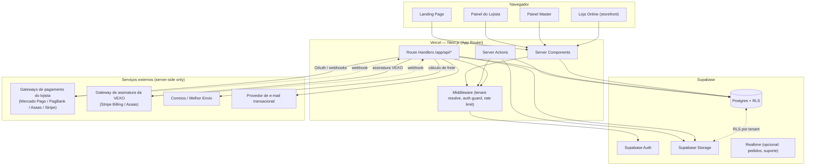

# VEXO — Arquitetura Técnica Oficial (PROMPT 22 + Revisão de Segurança)

> Status: **APROVADA — Etapa 1 (Fundação) em implementação.**
> Este documento é o entregável da etapa de planejamento, com as correções de segurança da
> Seção 25 aprovadas pelo dono do produto. A implementação segue a ordem da Seção 24, em PRs
> pequenos e revisáveis, com parada obrigatória para aprovação ao final de cada etapa.

> **Changelog**
> - **v1**: arquitetura geral (multi-tenant, ERD, RLS, trial, assinaturas, pagamentos, frete, storefront, pastas, testes, deploy, roadmap).
> - **v2**: revisão final de segurança e consistência pré-Etapa 1 — isolamento do storefront anônimo, Storage, auditoria do MASTER, credential vault, revisão risco-a-risco de RLS, cookie de tenant ativo, API pública, webhooks (recebidos/enviados), SSRF e upload/XSS.
> - **v3 (este documento)**: aprovação registrada. Decisões de §25.4 fechadas (ver §25.4) — papéis customizáveis fora do MVP, antivírus adiado para a etapa de Suporte, Supabase Vault confirmado, override manual de pagamento exige motivo obrigatório, retenção mínima de `audit_logs` fixada em 2 anos. Etapa 1 (Fundação) iniciada — ver histórico de implementação no repositório.

## Índice

0. [Auditoria do estado atual do projeto](#0-auditoria-do-estado-atual-do-projeto)
1. [Arquitetura geral](#1-arquitetura-geral)
2. [Diagrama dos principais componentes](#2-diagrama-dos-principais-componentes)
3. [Arquitetura multi-tenant](#3-arquitetura-multi-tenant)
4. [ERD conceitual](#4-erd-conceitual)
5. [Estrutura de tabelas](#5-estrutura-de-tabelas)
6. [Estratégia de RLS](#6-estratégia-de-rls)
7. [Estratégia de autenticação](#7-estratégia-de-autenticação)
8. [Estratégia de autorização (RBAC)](#8-estratégia-de-autorização-rbac)
9. [Estratégia de Storage](#9-estratégia-de-storage)
10. [Estratégia de APIs](#10-estratégia-de-apis)
11. [Estratégia de OAuth e Credential Vault (pagamentos do lojista)](#11-estratégia-de-oauth-e-credential-vault-pagamentos-do-lojista)
12. [Estratégia de Webhooks](#12-estratégia-de-webhooks)
13. [Estratégia de Trial](#13-estratégia-de-trial)
14. [Estratégia de Assinaturas e Planos](#14-estratégia-de-assinaturas-e-planos)
15. [Pagamentos: VEXO vs. Lojista](#15-pagamentos-vexo-vs-lojista)
16. [Frete e Motoboy próprio](#16-frete-e-motoboy-próprio)
17. [Loja Online e Personalização](#17-loja-online-e-personalização)
18. [Estratégia de segurança](#18-estratégia-de-segurança)
19. [Estrutura de pastas](#19-estrutura-de-pastas)
20. [Estratégia de testes](#20-estratégia-de-testes)
21. [Observabilidade](#21-observabilidade)
22. [Estratégia de deploy](#22-estratégia-de-deploy)
23. [Variáveis de ambiente](#23-variáveis-de-ambiente)
24. [Ordem recomendada de implementação](#24-ordem-recomendada-de-implementação)
25. [Revisão Final de Segurança e Consistência (Pré-Etapa 1)](#25-revisão-final-de-segurança-e-consistência-pré-etapa-1)

---

## 0. Auditoria do estado atual do projeto

### 0.1 O que existe hoje no repositório

O repositório `jonathagandrade-157/vexo` está, na prática, **vazio de código de aplicação**.
O único histórico é:

1. `589a400` — upload de `JAvendas-main (1).zip` (um projeto de terceiros, não relacionado à VEXO).
2. `42fc829` — remoção desse zip.

Não há `package.json`, não há app Next.js, não há schema de banco, não há Supabase configurado.
**Conclusão: este é um projeto greenfield.** Não existe dívida técnica de código para auditar —
a auditoria de "riscos e decisões" desta etapa recai sobre o material de referência (design) e
sobre as decisões de arquitetura que precisam ser tomadas *antes* da primeira linha de código.

### 0.2 O que existe como referência de produto (Stitch)

O arquivo `stitch_vexo_design_system.zip` traz **107 telas exportadas do Google Stitch**, cada uma
com `code.html` (HTML estático + Tailwind via CDN, sem framework, sem JS de aplicação, sem chamadas
de API) e `screen.png`. Também traz `vexo_design_system/DESIGN.md`, com os **design tokens oficiais**
(cores, tipografia, espaçamento, raio de borda, elevação).

Mapeando as 107 telas por domínio funcional, elas cobrem exatamente o escopo pedido no prompt:

| Domínio | Exemplos de telas | Módulo de arquitetura correspondente |
|---|---|---|
| Landing & aquisição | `landing_page_oficial_{desktop,mobile}`, `criar_conta_e_elegibilidade_trial`, `inicio_do_trial_sucesso`, `erro_trial_ja_utilizado` | Landing, Cadastro, Elegibilidade de Trial (§13) |
| Onboarding do lojista | `onboarding_boas_vindas`, `checklist`, `escolha_de_plano_trial`, `sobre_sua_marca`, `identidade_visual`, `produtos`, `pagamentos`, `frete`, `preview_da_loja`, `publicacao`, `vexo_ai`, `sucesso` | Wizard de setup (Painel do Lojista) |
| Painel do lojista — operação | `dashboard_principal`, `lista_de_produtos`, `adicionar_produto`, `categorias`, `controle_de_estoque`, `lista_de_pedidos`, `criar_pedido`, `detalhes_do_pedido`, `clientes`, `adicionar_cliente`, `detalhes_do_cliente`, `cupons` | Produtos, Categorias, Estoque, Pedidos, Clientes, Cupons (§5, §17) |
| Marketing & IA | `marketing`, `campanhas`, `automacoes`, `ai_marketing_spark`, `ai_sugestao_de_produto`, `ai_sugestao_de_estilo`, `ai_insights_e_relatorios`, `funil_de_conversao`, `origem_dos_clientes`, `desempenho_de_produtos`, `relatorio_de_vendas`, `relatorios_visao_geral` | Marketing, Analytics, Relatórios |
| Pagamentos & frete do lojista | `pagamentos`, `pagamentos_e_frete`, `frete_e_entregas`, `gestao_de_motoboy`, `gestao_de_entregas_mobile`, `rastreamento_de_entrega` | §11, §15, §16 |
| Personalização & configurações | `personalizacao_da_loja`, `escolha_de_temas`, `equipe_e_dominio`, `configuracoes_gerais`, `plano_e_seguranca` | §17, Domínios, Equipe/Permissões |
| Suporte (lojista) | `central_de_ajuda_lojista`, `meus_chamados_lojista`, `abrir_chamado_lojista`, `artigo_de_ajuda_lojista`, `conversa_do_chamado_lojista`, `suporte_mobile`, `chat_de_suporte_mobile` | Suporte |
| Painel Master | `master_visao_geral`, `master_gestao_de_lojas`, `master_detalhes_da_loja`, `master_assinaturas_e_faturamento`, `master_gestao_de_trials`, `master_seguranca_e_atividades`, `master_dashboard_de_suporte`, `master_gestao_de_chamados`, `master_detalhe_do_chamado` | Painel Master (§3, §14, §18) |
| Loja online (storefront) | `storefront_home`, `storefront_categoria`, `storefront_produto`, `storefront_carrinho`, `checkout_identificacao`, `checkout_pagamento`, `checkout_entrega`, `checkout_sucesso` | §17 |
| Estados de sistema | `trial_encerrado_estado`, `estados_do_sistema`, `estados_de_clientes`, `catalogo_vazio_desktop` | Empty states / error states (transversal) |

### 0.3 Riscos e decisões que a referência visual traz

- **HTML estático via `cdn.tailwindcss.com`**: não é código de produção reaproveitável diretamente —
  o Tailwind via CDN não compila, não faz *purge*, e as classes usam **nomes de cor arbitrários**
  gerados pelo Stitch (`surface-container-low`, `on-primary-fixed`, etc.) que batem com o
  `DESIGN.md`. **Decisão**: portar o `DESIGN.md` para `tailwind.config.ts` como fonte única de
  verdade de tema (cores, fontes, raio, espaçamento), e recriar cada tela como componente React
  usando essas mesmas classes semânticas — preservando 1:1 a identidade visual, sem redesenhar.
- **Imagens hospedadas em `lh3.googleusercontent.com`**: são placeholders do Stitch, não podem ir
  para produção. Precisam ser substituídas por Supabase Storage (uploads reais) ou por assets
  próprios da VEXO nas telas institucionais (landing, ícones da marca).
- **Fontes carregadas via Google Fonts (`fonts.googleapis.com`)**: ok para uso, mas devem ser
  carregadas via `next/font/google` (self-hosted pelo Next.js) para performance e para não
  depender de terceiro em runtime.
- **Nenhuma lógica de negócio nas telas**: os HTMLs são puramente visuais — não impõem nem
  contradizem nenhuma decisão de backend. Isso dá liberdade total para desenhar a arquitetura de
  dados e segurança do zero, sem "gambiarra" para encaixar em uma estrutura pré-existente.
- **Existência de telas "auditado"** (`dashboard_principal_auditado`, `master_visao_geral_auditado`,
  `storefront_home_auditado`) sugere que o próprio design já reservou estados para exibição de
  trilha de auditoria/compliance na UI — isso valida a necessidade de `audit_logs` desde o início
  (§18, §25).

**Regra de execução**: nenhuma tela será redesenhada. A implementação vai consumir `code.html` +
`screen.png` de cada pasta como referência pixel-a-pixel e recriar em componentes React
com dados reais, no lugar do HTML estático.

---

## 1. Arquitetura geral

VEXO é um **SaaS multi-tenant** com três superfícies de produto sobre uma base de dados e
autorização compartilhada:

1. **App do Lojista + Painel Master** (autenticado, `app.vexo.com`) — Next.js App Router,
   renderização majoritariamente no servidor (RSC), mutações via Server Actions/Route Handlers.
2. **Loja Online / Storefront** (pública, `*.vexo.com` ou domínio próprio do lojista) — Next.js
   com SSR/ISR por tenant, otimizada para SEO e Core Web Vitals.
3. **Landing Page + Cadastro** (pública, marketing) — Next.js estático/ISR.

Todas as três superfícies compartilham o mesmo backend lógico (Supabase Postgres + Auth + Storage),
mas são **deployments/rotas isoladas** para permitir políticas de cache, autenticação e escala
diferentes (a loja pública tem tráfego totalmente diferente do painel autenticado).

Princípios não negociáveis:

- **Multi-tenant desde o primeiro commit** — nunca "adicionar tenant depois".
- **Segurança em profundidade**: RLS no banco é a última linha de defesa, não a única. Toda
  operação também é validada na camada de aplicação (Server Action / Route Handler) antes de
  chegar ao banco.
- **Nenhum segredo no cliente**: Server Components/Actions e Route Handlers são donos de qualquer
  chamada que exija credencial sensível (service role key, secrets de gateway de pagamento, etc.).
- **O design do Stitch é lei de UI**: a arquitetura de dados/API é desenhada para alimentar as
  telas existentes, não o contrário.
- **A `anon key` do Supabase é pública por definição.** Todo o desenho de RLS (§6, §25.1) assume
  que qualquer visitante pode, em tese, montar uma chamada direta ao PostgREST do Supabase com a
  `anon key` — a segurança nunca depende de "o pedido só vem pelo nosso app".

---

## 2. Diagrama dos principais componentes



Camadas de código (server-side), do domínio até a infraestrutura:

```
Route Handler / Server Action
        │  (valida sessão, tenant, permissão)
        ▼
   Service Layer (regra de negócio, orquestra múltiplos repositórios)
        │
        ▼
   Repository Layer (acesso a dados, único ponto que fala SQL/Supabase client)
        │
        ▼
   Supabase (Postgres + RLS)
```

Nenhuma tela ou componente client chama o Supabase diretamente para escrita de dados sensíveis;
leituras client-side (quando existirem, ex.: Realtime de pedidos) usam o client Supabase com a
`anon key`, protegida integralmente por RLS.

---

## 3. Arquitetura multi-tenant

### 3.1 Modelo escolhido: **single database, shared schema, isolado por RLS**

Avaliação das três opções clássicas:

| Estratégia | Isolamento | Custo operacional | Escala | Decisão |
|---|---|---|---|---|
| Banco por tenant | Máximo | Altíssimo (migração em N bancos, conexões) | Ruim para milhares de lojas pequenas | ❌ |
| Schema por tenant | Alto | Alto (DDL cresce com tenants, `search_path` complexo) | Médio | ❌ |
| **Tabela compartilhada + `tenant_id` + RLS** | Alto quando bem implementado | Baixo (uma migração serve todos) | Excelente (é o modelo do próprio Supabase para SaaS) | ✅ **Escolhido** |

Justificativa: a VEXO precisa suportar **muitas lojas pequenas/médias**, não poucas lojas gigantes.
O modelo compartilhado com RLS é o padrão recomendado pelo próprio Supabase para esse perfil, é o
que melhor equilibra isolamento forte + custo operacional baixo + facilidade de manutenção de
schema (uma única migration para todos os tenants). Se no futuro um tenant enterprise exigir
isolamento físico, ele pode ser migrado individualmente para um banco dedicado sem redesenhar o
resto do sistema — a modelagem por `tenant_id` já dá essa saída.

### 3.2 Resolução de tenant

- **Painel do lojista/master**: o tenant ativo vem da sessão (usuário pode pertencer a múltiplos
  tenants — `tenant_members`). Um seletor de loja na UI grava o tenant ativo em um cookie
  assinado (`vexo_active_tenant`), lido pelo Middleware em toda request.
- **Storefront**: o tenant é resolvido por **host** (subdomínio `loja.vexo.com` ou domínio
  próprio cadastrado em `domains`), nunca por dado enviado pelo cliente. O Middleware resolve
  `host → tenant_id` e injeta no contexto da request antes de qualquer leitura de dado.
- **Nunca confiar em `tenant_id` vindo do body/query do client.** Toda Server Action/Route Handler
  redetermina o tenant a partir da sessão (painel) ou do host (storefront), e essa é a fonte usada
  para consultar o banco — nunca o `tenant_id` que o formulário eventualmente carregue.

#### 3.2.1 `vexo_active_tenant`: o que o cookie pode e não pode fazer

Este cookie é **contexto de UI, nunca uma decisão de autorização.** Especificação exata:

- **Formato**: assinado (HMAC com segredo do servidor), `HttpOnly`, `Secure`, `SameSite=Lax` —
  não legível/gravável por JavaScript no browser, e qualquer adulteração de valor invalida a
  assinatura.
- **O que ele faz**: indica "qual loja o usuário estava olhando por último", para a UI abrir no
  lugar certo e para o Middleware montar o link/breadcrumb correto. Nada mais.
- **O que ele nunca faz sozinho**: autorizar uma query. Toda leitura/escrita que usa "tenant
  ativo" segue este fluxo, sem exceção:
  1. ler o cookie e validar a assinatura;
  2. **revalidar contra `tenant_members`** que `auth.uid()` tem uma linha `status = 'active'`
     para exatamente aquele `tenant_id` (consulta direta, sem cache de longa duração — TTL curto
     o suficiente para refletir uma remoção de equipe em minutos, não em dias);
  3. se a validação falhar (cookie assinado corretamente mas apontando para um tenant do qual o
     usuário foi removido, ou cookie forjado/corrompido), a aplicação **nunca** usa aquele valor —
     cai de volta para o primeiro tenant válido do usuário, reescreve o cookie, e caso o usuário
     não pertença a tenant nenhum, redireciona para onboarding.
- **Rede de segurança**: mesmo que um bug de aplicação um dia confie cegamente no valor do cookie
  para montar um filtro, a RLS (`private.is_tenant_member`/`private.has_permission`, §6) usa
  exclusivamente `auth.uid()` + a tabela real `tenant_members` — nunca o cookie — então uma
  consulta indevida ainda retornaria vazio/negado no banco. O cookie **não é** e **nunca será**
  uma entrada aceita por nenhuma policy de RLS.

### 3.3 Isolamento por camada

| Camada | Mecanismo de isolamento |
|---|---|
| Banco (Postgres) | RLS obrigatório em toda tabela com `tenant_id` (§6) |
| Storage | Path prefixado por `tenant_id/...`, gerado no servidor, + policy de bucket (§9) |
| API | Toda rota resolve o tenant a partir da sessão/host/API key, nunca do payload (§10) |
| Webhooks recebidos | Assinatura do provedor + `tenant_id` resolvido pelo `connected_account_id` cadastrado, nunca pelo payload cru (§12) |
| Cache/CDN | Chave de cache sempre inclui `tenant_id`/host |
| Background jobs | Todo job carrega `tenant_id` explícito, nunca itera "todos os registros" sem filtro |
| Storefront anônimo | Ver §3.4 — RLS com policies específicas para `anon`, nunca dependência de que "o pedido vem do nosso Next.js" |

### 3.4 Storefront público e RLS para visitante anônimo

Este é o ponto mais crítico da arquitetura de isolamento, porque o storefront é acessado por
visitantes **sem sessão** (`auth.uid()` é `NULL`, papel Postgres `anon`) — e a `anon key` usada
para consultar o Supabase é pública (embutida no bundle do client). Isso significa que a proteção
não pode assumir "só o nosso Next.js faz essa query" — **qualquer pessoa pode montar uma chamada
direta ao PostgREST do Supabase com a `anon key`**, sem passar pelo Middleware, pelo host, ou por
qualquer código nosso. O desenho abaixo assume esse cenário como padrão, não como caso extremo.

**Modelo de ameaça**: um atacante com a `anon key` (pública) tentando, via chamada direta ao
Supabase (não via `loja-a.vexo.com`):
1. ler produtos/temas **não publicados** de qualquer tenant;
2. ler dados administrativos (clientes, pedidos, pagamentos, membros de equipe, credenciais) de
   **qualquer** tenant;
3. escrever um pedido com preço/total manipulado;
4. escrever/ler dado de um tenant diferente do que o host `loja-a.vexo.com` estava servindo.

**Garantias e mecanismos, ponto a ponto do que foi pedido:**

1. **Tenant resolvido exclusivamente pelo host/domínio.** O Middleware resolve
   `host → tenant_id` (via `domains`) e essa é a única fonte usada pelos Server Components para
   decidir "qual loja estou renderizando". Nenhuma rota de storefront aceita `tenant_id` como
   parâmetro de URL, query string ou body para decidir o que exibir — um `slug` de produto, por
   exemplo, é resolvido com `WHERE tenant_id = :tenant_do_host AND slug = :slug`, nunca só
   `WHERE slug = :slug`.
2. **Nenhum `tenant_id` confiado vindo do browser** — vale tanto para as chamadas via nosso app
   (regra acima) quanto para uma chamada direta ao Supabase: mesmo que um atacante envie um
   `tenant_id` arbitrário em uma query direta ao PostgREST, a RLS abaixo é o que realmente decide
   o que é retornado — o "resolver pelo host" é a política de UX/roteamento da aplicação, a RLS é
   a política de dados que vale independentemente da origem da chamada.
3. **Somente dados públicos/publicados são expostos ao papel `anon`.** Cada tabela que tem
   conteúdo público (`products`, `categories`, `product_images`, `store_settings`, `store_themes`)
   ganha uma policy de `SELECT` **específica para `anon`**, adicional à policy de membro de
   tenant, restrita a linhas com uma flag explícita de publicação:

   ```sql
   -- Exemplo ilustrativo — não é DDL final
   create policy "anon can select published products"
     on public.products for select
     to anon
     using ( status = 'published' );
   ```

   Como policies do mesmo comando (`SELECT`) são combinadas com `OR`, um membro do tenant continua
   vendo rascunhos (via a policy de `is_tenant_member`), enquanto `anon` **só** vê o que está
   `published` — nunca as duas condições se misturam para o mesmo usuário.
4. **Nenhum dado administrativo é acessível pelo storefront.** Tabelas como `customers`, `orders`,
   `order_items`, `addresses`, `payments`, `payment_credentials_vault`, `tenant_members`,
   `inventory` (quantidade exata de estoque é informação operacional, não pública),
   `subscriptions`, `invoices`, `webhook_endpoints`, `api_keys`, `audit_logs` **não têm nenhuma
   policy de `SELECT` para o papel `anon`** — RLS nega por padrão na ausência de policy, então o
   resultado de qualquer tentativa de leitura direta é vazio/erro de permissão, não "vazio porque
   o filtro de tenant não bateu".
5. **Nenhum acesso público atravessa para outro tenant.** Como cada policy de `anon` filtra por
   `status = 'published'` **sem nenhuma referência a "qual tenant está sendo servido agora"**, uma
   chamada direta ao Supabase para os products de `loja-b` enquanto o host é `loja-a.vexo.com` de
   fato consegue ler o catálogo público de `loja-b` — **e isso é o comportamento correto e
   esperado**: o catálogo publicado de uma loja pública é, por definição, público na internet (é
   uma vitrine de e-commerce, não um dado sigiloso). O que a arquitetura garante é que isso nunca
   inclui dado administrativo/privado de `loja-b`, e que a **página servida em `loja-a.vexo.com`
   nunca mistura produto de `loja-b`** porque a aplicação sempre filtra por
   `tenant_id = tenant_do_host` — a policy de `anon` é "o que é permitido em tese", o filtro de
   host é "o que a página realmente busca". Os testes de §3.4.2 provam ambas as garantias
   separadamente.
6. **RLS continua fazendo parte da defesa** — de fato, para o storefront anônimo, RLS deixa de ser
   "mais uma camada" e passa a ser **a única camada realmente vinculante**, já que não há sessão
   nem cookie assinado para um atacante direto ao Supabase respeitar. Middleware/host são proteção
   de roteamento da aplicação; RLS é proteção de dado.

#### 3.4.1 Onde `service_role` é permitido no caminho do storefront, e por quê

`service_role` ignora RLS — por isso seu uso é **restrito a três pontos, todos server-side, todos
com filtros explícitos de tenant reimplementados em SQL** (nunca "confia em tudo porque é
service_role"):

| Onde | Por que precisa de `service_role` | Como o tenant escape é evitado mesmo assim |
|---|---|---|
| **Criação de pedido no checkout** (`create_order_from_cart`, função Postgres `security definer` chamada via RPC por um Route Handler) | Precisa: (a) recalcular preço/subtotal/frete a partir de `products`/`coupons` no servidor — o `anon` nunca tem permissão de `INSERT` direto em `orders` com um `total` client-supplied; (b) decrementar `inventory` de forma atômica (checar disponibilidade + reservar em uma transação, evitando overselling sob concorrência) | A função recebe `tenant_id` **resolvido pelo host no Middleware**, não do body; todo `SELECT`/`UPDATE` dentro da função é filtrado por esse `tenant_id` explicitamente nas cláusulas `WHERE`; a função rejeita qualquer `product_id`/`variant_id` que não pertença àquele `tenant_id`; o preço final é sempre recalculado a partir do banco, o valor enviado pelo cliente (se houver) é ignorado |
| **Processamento de webhook de pagamento** (`/api/webhooks/{provider}`) | Precisa atualizar `payments`/`orders.payment_status` de qualquer tenant, mas o payload chega sem sessão de usuário | O tenant é resolvido pelo `connected_account_id` do payload **verificado por assinatura**, cruzado contra `store_payment_providers` (nunca por um campo "tenant_id" livre do payload); o `UPDATE` é sempre `WHERE tenant_id = :tenant_resolvido AND order_id = :order_id` |
| **Renderização de tema/domínio no Middleware** (resolução `host → tenant_id`) | Estritamente falando **não precisa** de `service_role` — `domains` pode ter uma policy de `SELECT` pública para `anon` restrita a `status = 'active'`, já que "qual host mapeia para qual loja" não é segredo. Documentado aqui para deixar explícito que este ponto **não** usa `service_role` | N/A — usa `anon` com policy pública restrita |

Fora desses pontos, **nenhuma rota de storefront usa `service_role`.** Leituras de catálogo/tema
usam o client com `anon key` (protegido pelas policies do §3.4), e qualquer novo uso de
`service_role` em uma feature futura precisa justificar, nesta mesma tabela, por que RLS granular
não é suficiente e quais filtros substituem a checagem que a RLS faria.

#### 3.4.2 Testes automatizados obrigatórios (isolamento do storefront)

Suite dedicada (`tests/integration/storefront-isolation.test.ts`), roda no CI a cada PR que toca
`supabase/migrations/` ou `features/storefront/`, `features/checkout/`:

1. **Leitura direta via `anon key` (bypass do app)**: usando o client Supabase puro (sem passar
   pelo Next.js/Middleware), autenticado só como `anon`:
   - `SELECT * FROM products WHERE tenant_id = <Tenant B>` enquanto logicamente "navegando" como
     Tenant A → deve retornar **somente** produtos `status = 'published'` do Tenant B (esperado —
     catálogo público), e **nunca** produtos com outro `status`.
   - `SELECT * FROM customers|orders|payments|tenant_members|payment_credentials_vault WHERE
     tenant_id = <qualquer tenant>` → deve retornar **0 linhas / erro de permissão**, para
     qualquer tenant, sem exceção.
2. **Checkout com preço manipulado**: chamar o Route Handler de criação de pedido enviando um
   `total`/`price` divergente do preço real do produto no banco → asserir que o pedido criado usa
   o preço **recalculado no servidor**, nunca o valor enviado.
3. **Checkout com `tenant_id` cruzado**: chamar a criação de pedido resolvendo o host como Tenant A
   mas incluindo no body um `product_id` pertencente ao Tenant B → asserir rejeição (erro), nunca
   criação de pedido misto.
4. **E2E de dois hosts simultâneos** (Playwright): abrir `loja-a.vexo.com` e `loja-b.vexo.com` na
   mesma execução de teste e asserir que a lista de produtos, tema, banners e qualquer dado
   renderizado nunca se misturam entre as duas abas — cobre também cache/ISR (ver item 5).
5. **Cache/ISR por tenant**: as tags de revalidação (`revalidateTag`) e as chaves de cache do
   Next.js incluem o `tenant_id`/host; teste dedicado força a geração de página estática para dois
   tenants em sequência e verifica que a resposta para `loja-a` nunca é servida (via cache) para
   uma request de `loja-b`.
6. **Rate limiting/enumeração**: teste (fora do critério de aprovação de merge, roda em pipeline
   separado) que confirma que buscas repetidas de slugs de produto no storefront são limitadas por
   IP, mitigando varredura/enumeração de catálogo de outra loja em escala.

Esta suite é **pré-requisito de aprovação da Etapa 1** (ver checklist em §25.5) antes de qualquer
tabela pública ser criada com dados reais.

---

## 4. ERD conceitual

Visão de alto nível por domínio (relacionamentos entre agregados, não todas as colunas —
detalhamento de campos na Seção 5):

```mermaid
erDiagram
    PROFILES ||--o{ TENANT_MEMBERS : "é membro"
    TENANTS ||--o{ TENANT_MEMBERS : "possui"
    TENANT_MEMBERS }o--|| ROLES : "tem papel"
    ROLES ||--o{ ROLE_PERMISSIONS : agrupa
    ROLE_PERMISSIONS }o--|| PERMISSIONS : referencia
    PROFILES ||--o{ PLATFORM_ADMINS : "pode ser MASTER"

    TENANTS ||--o{ PRODUCTS : possui
    TENANTS ||--o{ CATEGORIES : possui
    CATEGORIES ||--o{ PRODUCTS : classifica
    PRODUCTS ||--o{ PRODUCT_VARIANTS : possui
    PRODUCTS ||--o{ INVENTORY : controla
    PRODUCT_VARIANTS ||--o{ INVENTORY : controla

    TENANTS ||--o{ CUSTOMERS : possui
    CUSTOMERS ||--o{ ADDRESSES : possui
    TENANTS ||--o{ ORDERS : possui
    CUSTOMERS ||--o{ ORDERS : realiza
    ORDERS ||--o{ ORDER_ITEMS : contém
    PRODUCTS ||--o{ ORDER_ITEMS : referencia
    TENANTS ||--o{ COUPONS : possui
    ORDERS }o--o| COUPONS : aplica

    TENANTS ||--o{ PAYMENT_CREDENTIALS_VAULT : conecta
    ORDERS ||--o{ PAYMENTS : gera
    TENANTS ||--o{ SHIPPING_METHODS : configura
    TENANTS ||--o{ COURIERS : possui
    ORDERS ||--o| DELIVERY_ORDERS : gera
    DELIVERY_ORDERS }o--o| COURIERS : atribui

    TENANTS ||--|| STORE_SETTINGS : configura
    TENANTS ||--|| STORE_THEMES : personaliza
    TENANTS ||--o{ DOMAINS : registra

    TENANTS ||--o{ SUBSCRIPTIONS : assina
    PLANS ||--o{ SUBSCRIPTIONS : define
    SUBSCRIPTIONS ||--o{ SUBSCRIPTION_EVENTS : gera
    SUBSCRIPTIONS ||--o{ INVOICES : fatura
    TENANTS ||--o| TRIAL_RECORDS : possui

    TENANTS ||--o{ SUPPORT_TICKETS : abre
    SUPPORT_TICKETS ||--o{ SUPPORT_MESSAGES : contém

    TENANTS ||--o{ API_KEYS : gera
    TENANTS ||--o{ WEBHOOK_ENDPOINTS : configura
    WEBHOOK_ENDPOINTS ||--o{ WEBHOOK_DELIVERIES : registra

    TENANTS ||--o{ AUDIT_LOGS : registra
```



---

## 5. Estrutura de tabelas

Notação: `tenant_id` presente = tabela **isolada por tenant** (RLS obrigatória). Tabelas sem
`tenant_id` são **globais da plataforma** (planos, permissões, artigos de ajuda, admins).

### 5.1 Identidade, tenants e RBAC

| Tabela | Campos-chave | Notas |
|---|---|---|
| `profiles` | `id (=auth.users.id)`, `full_name`, `avatar_url`, `phone`, `created_at` | 1:1 com `auth.users`, criado via trigger no signup |
| `tenants` | `id`, `name`, `slug`, `status`, `document_hash`, `plan_id`, `created_by`, `created_at` | uma "loja"; `document_hash` = CPF/CNPJ com hash, nunca em texto puro aqui |
| `tenant_members` | `id`, `tenant_id`, `user_id`, `role_id`, `status`, `invited_by`, `created_at` | resolve N:N usuário↔loja; **policies revisadas em §25.1** para impedir auto-escalação de papel |
| `roles` | `id`, `tenant_id (sempre NULL no MVP)`, `key`, `name`, `is_system (sempre true no MVP)` | `OWNER, ADMIN, MANAGER, OPERATOR, SUPPORT` como papéis de sistema fixos — **decisão da revisão de segurança**: papéis por tenant customizáveis ficam fora do MVP (§25.4) para eliminar uma classe de risco de escalação de privilégio |
| `permissions` | `id`, `key` (`products.view`, `orders.update`, ...), `group` | catálogo fixo, seed via migration |
| `role_permissions` | `role_id`, `permission_id` | matriz RBAC (§8); **imutável para tenants** enquanto papéis forem só de sistema |
| `platform_admins` | `id`, `user_id`, `role (MASTER, SUPPORT_AGENT)`, `created_at` | **tabela separada e sem `tenant_id`**; sem nenhuma policy de escrita para `anon`/`authenticated` (§25.1) — gestão só fora da aplicação |

### 5.2 Catálogo e estoque

| Tabela | Campos-chave | Notas |
|---|---|---|
| `categories` | `id`, `tenant_id`, `parent_id`, `name`, `slug`, `position`, `image_path`, `status` | árvore simples via `parent_id`; `status` público segue o mesmo padrão de `products` (§3.4) |
| `products` | `id`, `tenant_id`, `category_id`, `name`, `slug`, `description (jsonb estruturado, §25.6)`, `price`, `compare_at_price`, `status`, `created_at` | |
| `product_variants` | `id`, `product_id`, `tenant_id`, `name`, `sku`, `price_override`, `attributes (jsonb)` | tamanho/cor etc. |
| `product_images` | `id`, `product_id`, `tenant_id`, `storage_path`, `position` | aponta para Supabase Storage (§9) |
| `inventory` | `id`, `tenant_id`, `product_id`, `variant_id (nullable)`, `quantity`, `reserved`, `low_stock_threshold` | reserva em pedido pendente evita overselling; **nunca exposta a `anon`** — storefront só recebe um booleano `in_stock` derivado, nunca a quantidade exata |

### 5.3 Vendas

| Tabela | Campos-chave | Notas |
|---|---|---|
| `customers` | `id`, `tenant_id`, `name`, `email`, `phone`, `document_hash`, `created_at` | cliente da **loja**, distinto de `profiles`; sem policy de `SELECT` para `anon` (§3.4) |
| `addresses` | `id`, `tenant_id`, `customer_id`, `label`, `street`, `number`, `city`, `state`, `zip`, `is_default` | |
| `orders` | `id`, `tenant_id`, `customer_id`, `number`, `status`, `payment_status`, `fulfillment_status`, `subtotal`, `discount_total`, `shipping_fee`, `total`, `created_at` | `number` sequencial por tenant, não PK; `INSERT` só via RPC server-side (§3.4.1), nunca `INSERT` direto de `anon` |
| `order_items` | `id`, `order_id`, `tenant_id`, `product_id`, `variant_id`, `name_snapshot`, `price_snapshot`, `qty` | snapshot evita que edição futura do produto altere pedidos antigos |
| `coupons` | `id`, `tenant_id`, `code`, `type (percent\|fixed)`, `value`, `usage_limit`, `usage_count`, `starts_at`, `ends_at`, `status` | validado e aplicado dentro da mesma função server-side que calcula o total (§3.4.1), nunca aceito como desconto já calculado vindo do cliente |
| `order_coupons` | `order_id`, `coupon_id`, `discount_applied` | permite auditar valor aplicado mesmo se o cupom mudar depois |

### 5.4 Pagamentos (separados por domínio — ver §15)

| Tabela | Campos-chave | Notas |
|---|---|---|
| `store_payment_providers` | `id`, `tenant_id`, `provider`, `status`, `connected_account_id`, `created_at` | metadado público da conexão (sem segredo) |
| `payment_credentials_vault` | `id`, `tenant_id`, `provider`, `key_version`, `encrypted_access_token`, `encrypted_refresh_token`, `nonce`, `expires_at`, `created_at`, `rotated_at` | **acesso só via `service_role`**; RLS nega tudo (inclusive leitura) para `anon`/`authenticated`; detalhamento completo de criptografia/rotação em §11.1 |
| `payments` | `id`, `tenant_id`, `order_id`, `provider`, `external_id`, `status`, `amount`, `method`, `paid_at` | pagamento do **cliente final** para a loja; sem `INSERT`/`UPDATE` para `anon`/`authenticated` — só via webhook/checkout server-side |
| `plans` | `id`, `code (starter\|pro\|business)`, `name`, `price_month`, `price_year`, `limits (jsonb)`, `features (jsonb)`, `status` | tabela global; único lugar onde limites existem (requisito §9 do prompt original) |
| `subscriptions` | `id`, `tenant_id`, `plan_id`, `status`, `current_period_end`, `cancel_at_period_end`, `provider`, `external_subscription_id` | assinatura do **lojista com a VEXO** |
| `subscription_events` | `id`, `subscription_id`, `type`, `metadata (jsonb)`, `created_at` | trilha de upgrade/downgrade/cancelamento |
| `invoices` | `id`, `tenant_id`, `subscription_id`, `amount`, `status`, `due_date`, `paid_at`, `external_invoice_id` | faturas da assinatura VEXO |

### 5.5 Trial

| Tabela | Campos-chave | Notas |
|---|---|---|
| `trial_eligibility` | `id`, `document_hash (unique)`, `first_tenant_id`, `created_at` | HMAC do CPF/CNPJ com segredo do servidor; nunca expõe o documento (§13) |
| `trial_records` | `id`, `tenant_id (unique)`, `started_at`, `ends_at`, `status (active\|converted\|expired)`, `converted_plan_id`, `converted_at` | |

### 5.6 Frete e entrega (ver §16)

| Tabela | Campos-chave | Notas |
|---|---|---|
| `shipping_methods` | `id`, `tenant_id`, `type (correios\|melhor_envio\|carrier\|pickup\|own_courier)`, `config (jsonb)`, `status` | |
| `delivery_zones` | `id`, `tenant_id`, `name`, `cep_ranges (jsonb)`, `fee`, `eta_minutes` | usado pelo motoboy próprio |
| `couriers` | `id`, `tenant_id`, `name`, `phone`, `vehicle_type`, `status` | |
| `delivery_orders` | `id`, `tenant_id`, `order_id`, `courier_id (nullable)`, `status`, timestamps por etapa | status: `pending → accepted → preparing → out_for_delivery → delivered / cancelled` |

### 5.7 Loja, personalização e domínio

| Tabela | Campos-chave | Notas |
|---|---|---|
| `store_settings` | `id`, `tenant_id (unique)`, `business_hours (jsonb)`, `contact_info (jsonb)`, `checkout_config (jsonb)`, `seo (jsonb)` | leitura pública restrita aos campos não sensíveis via `SELECT` para `anon` (ex.: horário de funcionamento sim, `checkout_config` interno não — ver §25.6 para a matriz campo a campo) |
| `store_themes` | `id`, `tenant_id (unique)`, `logo_path`, `favicon_path`, `colors (jsonb)`, `fonts (jsonb)`, `layout (jsonb)`, `sections (jsonb)`, `version` | `jsonb` estruturado com schema validado na aplicação — **nunca HTML arbitrário** (§17, §25.6) |
| `domains` | `id`, `tenant_id`, `hostname (unique)`, `type (subdomain\|custom)`, `status`, `verification_token`, `ssl_status` | `SELECT` pública restrita a `status = 'active'` — é o que o Middleware usa para resolver host (§3.4.1) |

### 5.8 Integrações, API e Webhooks

| Tabela | Campos-chave | Notas |
|---|---|---|
| `integrations` | `id`, `tenant_id`, `type`, `status`, `config (jsonb, não sensível)`, `credentials_vault_ref` | segredos ficam no vault (§11.1), nunca aqui |
| `api_keys` | `id`, `tenant_id`, `name`, `key_prefix`, `hashed_key`, `scopes (text[])`, `last_used_at`, `status` | detalhamento completo (hash, escopos, revogação) em §10.1 |
| `webhook_endpoints` | `id`, `tenant_id`, `url`, `encrypted_secret`, `events (text[])`, `status` | **correção da revisão**: campo passa de `secret_hash` para `encrypted_secret` — assinar um payload de saída exige o segredo em texto, não apenas seu hash (§12.2, §25.2) |
| `webhook_deliveries` | `id`, `webhook_endpoint_id`, `event_type`, `event_id`, `payload (jsonb)`, `status`, `attempt_count`, `last_attempt_at`, `response_code` | idempotência via `event_id` único |

### 5.9 Suporte, notificações e auditoria

| Tabela | Campos-chave | Notas |
|---|---|---|
| `support_tickets` | `id`, `tenant_id`, `opened_by`, `subject`, `status`, `priority`, `category`, `assigned_agent_id`, `created_at` | |
| `support_messages` | `id`, `ticket_id`, `tenant_id`, `sender_type (lojista\|master\|system)`, `sender_id`, `body`, `attachments (jsonb)`, `created_at` | texto plano, ver matriz de §25.6 |
| `help_articles` | `id`, `slug`, `title`, `body`, `category`, `status`, `published_at` | global, sem `tenant_id`; autoria só da equipe VEXO |
| `notifications` | `id`, `tenant_id (nullable)`, `user_id`, `type`, `payload (jsonb)`, `read_at`, `created_at` | |
| `audit_logs` | `id`, `tenant_id (nullable p/ ações de MASTER)`, `actor_user_id`, `actor_type`, `action`, `resource_type`, `resource_id`, `before (jsonb, redigido)`, `after (jsonb, redigido)`, `reason (nullable, obrigatório para overrides financeiros — §18.2)`, `metadata (jsonb)`, `request_id (nullable)`, `ip`, `user_agent`, `created_at` | **append-only, garantido por `REVOKE` de privilégio + trigger, não só por RLS** — detalhamento completo em §25.3; retenção mínima de **2 anos**, decisão oficial em §25.4 |
| `daily_store_metrics` | `tenant_id`, `date`, `visits`, `orders_count`, `revenue`, `conversion_rate` | agregação para os dashboards de analytics/relatórios, calculada por job |

**Total: ~34 tabelas de negócio + tabelas do `auth` schema do Supabase.** Todas as tabelas com
`tenant_id` têm índice composto `(tenant_id, id)`, FK `tenant_id → tenants(id) ON DELETE RESTRICT`
(nunca CASCADE em dados financeiros/pedidos), e um **trigger de imutabilidade de `tenant_id`**
(§25.1) que impede qualquer `UPDATE` de mover a linha para outro tenant.

---

## 6. Estratégia de RLS

RLS é **obrigatória e habilitada por padrão** (`ENABLE ROW LEVEL SECURITY` + `FORCE ROW LEVEL
SECURITY`) em toda tabela de negócio. Nenhuma tabela fica com RLS desabilitada "temporariamente".

### 6.1 Funções auxiliares (security definer, no schema `auth`/`private`)

- `private.is_tenant_member(tenant_id uuid) returns boolean` — verifica se `auth.uid()` está em
  `tenant_members` com `status = 'active'` para aquele tenant.
- `private.has_permission(tenant_id uuid, perm_key text) returns boolean` — resolve
  `tenant_members → roles → role_permissions → permissions` para o usuário atual.
- `private.is_platform_admin() returns boolean` — verifica `platform_admins` para `auth.uid()`.
- `private.is_platform_support() returns boolean` — variante restrita a `SUPPORT_AGENT`.
- `private.is_owner(tenant_id uuid) returns boolean` — variante estrita usada nas policies que só
  o `OWNER` pode exercer (remover outro `OWNER`, atribuir o papel `OWNER`) — ver §25.1.

Essas funções são `security definer` para poder ler tabelas de RBAC sem expor policies
recursivas complexas em cada tabela de negócio.

### 6.2 Padrão de policy por tabela tenant-scoped

```sql
-- Exemplo ilustrativo (não é DDL final) para "products"
create policy "tenant members can select products"
  on public.products for select
  using ( private.is_tenant_member(tenant_id) or private.is_platform_admin() );

create policy "anon can select published products"
  on public.products for select
  to anon
  using ( status = 'published' );

create policy "users with products.create can insert"
  on public.products for insert
  with check ( private.has_permission(tenant_id, 'products.create') );

create policy "users with products.update can update"
  on public.products for update
  using ( private.has_permission(tenant_id, 'products.update') )
  with check ( private.has_permission(tenant_id, 'products.update') );
  -- a imutabilidade de tenant_id NÃO depende desta policy — é garantida por um
  -- trigger BEFORE UPDATE separado (§25.1), porque uma policy sozinha permitiria
  -- que um usuário com permissão em dois tenants "movesse" a linha entre eles.
```

Regras gerais:

- **SELECT**: membros ativos do tenant veem tudo do seu tenant; **`anon` só vê o que tiver policy
  própria e explícita restrita a conteúdo publicado** (§3.4) — nunca uma policy genérica "todo
  mundo pode ler".
- **INSERT/UPDATE/DELETE**: sempre gated por `has_permission(tenant_id, 'recurso.acao')`, nunca só
  por "é membro do tenant"; e sempre com o trigger de imutabilidade de `tenant_id` (§25.1) como
  camada adicional, independente da policy.
- **MASTER**: enxerga tudo via `is_platform_admin()`, mas **toda leitura/ação de MASTER em dado de
  tenant gera `audit_logs`** (§25.3), e MASTER não tem policy de escrita direta em dados
  operacionais do lojista (produtos, pedidos) — apenas em tabelas de administração da plataforma
  (`tenants.status`, `trial_records`, `subscriptions`, `support_tickets`).
- **Tabelas de vault/segredo**: `using (false)` para `anon`/`authenticated`, sem exceção — únicas
  leitoras/escritoras são Route Handlers usando `service_role`, nunca exposta ao browser (§11.1).
- **`audit_logs`**: policy de INSERT só para `service_role`; **UPDATE/DELETE bloqueados por
  `REVOKE` de privilégio de tabela, não apenas por RLS** (§25.3), porque `service_role` tem
  `BYPASSRLS` no Postgres e uma policy sozinha não o conteria.

### 6.3 Testes de RLS

RLS é tratada como contrato testável, não como configuração "e esperar que funcione" — ver §20
(testes de isolamento multi-tenant rodando com `service_role` para setup e `authenticated`/`anon`
com JWT de tenants diferentes para validar negação de acesso cruzado), mais a suite dedicada de
storefront anônimo em §3.4.2 e a revisão risco-a-risco em §25.1.

---

## 7. Estratégia de autenticação

- **Supabase Auth** para `profiles` (usuários da plataforma: lojistas, equipe, MASTER) — e-mail/senha
  + OAuth social (Google) como opção. MFA (TOTP) disponível para contas MASTER e OWNER (obrigatório
  para MASTER — reforçado em §25.3, já que MASTER é o papel com maior blast radius).
- **Sessão via cookies HTTP-only** (`@supabase/ssr`), nunca `localStorage`, para mitigar XSS
  roubando token de sessão.
- **Clientes da loja (`customers`)** no checkout **não** usam necessariamente Supabase Auth no MVP —
  fluxo de "identificação" (nome/e-mail/telefone) sem senha, como já sugerem as telas
  `checkout_identificacao`. Conta de cliente com login (para "meus pedidos") é uma evolução
  posterior, usando Supabase Auth em um *tenant de audiência* separado do `profiles` administrativo;
  até lá, "ver meu pedido" usa um token de pedido não-adivinhável (enviado por e-mail), nunca uma
  policy de `SELECT` aberta por `customer_id`/`order_id` sequencial.
- **Middleware** (`middleware.ts`) refresca a sessão em toda request e resolve:
  1. usuário autenticado (ou não) a partir do cookie;
  2. tenant ativo (painel, revalidado conforme §3.2.1) ou tenant por host (storefront, §3.4);
  3. redireciona para login/trial-encerrado/onboarding conforme o estado (telas
     `trial_encerrado_estado`, `erro_trial_ja_utilizado` já preveem esses redirects).
- **Convite de equipe** (`vexo_equipe_e_dominio`): fluxo de convite por e-mail gera um registro
  `tenant_members(status='invited')` com token de convite assinado e expiração; aceite cria/associa
  o `auth.users` e muda status para `active`. O convite **nunca** permite que o convidado escolha
  seu próprio `role_id` — quem convida escolhe o papel, e atribuir `OWNER` é restrito a quem já é
  `OWNER` (§25.1).

---

## 8. Estratégia de autorização (RBAC)

Duas camadas, sempre as duas juntas — nunca uma sozinha:

1. **RLS no banco** (§6) — última linha de defesa, impossível de contornar mesmo com bug de
   aplicação.
2. **Guard na aplicação** (Server Action/Route Handler) — falha rápido, com mensagem de erro
   amigável, antes de bater no banco; também é onde se valida regra de negócio que RLS não
   expressa bem (ex.: limite de `products_limit` do plano).

Papéis de sistema e mapeamento inicial de permissões (a matriz completa fica em uma migration de
seed, não hardcoded em código de UI). **Decisão confirmada na revisão de segurança**: no MVP os
seis papéis abaixo são **fixos e não editáveis por tenant** (`roles.is_system = true` sempre) —
tenants atribuem estes papéis a membros, mas não redefinem o que cada papel pode fazer. Papéis
customizáveis por tenant são uma evolução futura, com desenho de RLS próprio, fora do escopo atual
(ver decisão pendente §25.4):

| Papel | Descrição | Exemplo de permissões |
|---|---|---|
| `OWNER` | Dono da loja, criador do tenant | todas as permissões do tenant, incluindo `billing.manage`, `team.manage`, único que pode atribuir/remover `OWNER` |
| `ADMIN` | Administrador de confiança do OWNER | tudo exceto billing e exclusão do tenant |
| `MANAGER` | Gestão operacional (produtos, pedidos, marketing) | `products.*`, `orders.*`, `customers.*`, `coupons.*` |
| `OPERATOR` | Operação do dia a dia (expedição, atendimento) | `orders.view`, `orders.update`, `customers.view` |
| `SUPPORT` | Suporte interno da VEXO alocado à loja (raro, temporário) | `support.view`, leitura limitada |
| `MASTER` | Equipe VEXO — plataforma inteira | gestão de tenants, planos, trials, billing da VEXO, suporte — nunca atribuído via fluxo de autoatendimento (§25.1) |

Chaves de permissão seguem `recurso.acao` (`products.view`, `products.create`, `products.update`,
`products.delete`, `orders.view`, `orders.update`, `customers.view`, `customers.update`,
`settings.view`, `settings.update`, `team.view`, `team.manage`, `billing.view`, `billing.manage`,
`support.view`, `support.manage`, ...) exatamente como listado no prompt — isso vira o catálogo de
`permissions` (seed) e é checado tanto na policy RLS quanto no guard de aplicação (um único source
of truth: a tabela `role_permissions`, lida por ambas as camadas).

---

## 9. Estratégia de Storage

Storage é tratado com o mesmo rigor de RLS: **todo bucket é privado por padrão**, e tornar um
bucket público é uma decisão explícita, documentada nesta tabela — nunca um efeito colateral de
configuração. Nenhum arquivo sensível é colocado em um bucket público, e a divisão por bucket
segue exatamente a sensibilidade do conteúdo (nunca "um bucket para tudo com convenção de path").

### 9.1 Buckets

| Bucket | Conteúdo | Público de leitura? | Quem escreve | Path |
|---|---|---|---|---|
| `product-media` | imagens de produto | **Sim** (é vitrine pública, necessário para storefront/SEO) — mas nunca contém nada além de imagens de produto | `products.update`/`products.create`, via servidor (§9.3) | `{tenant_id}/products/{product_id}/{file}` |
| `store-branding` | logo, favicon, banners do tema | **Sim** (mesma razão) | `settings.update`, via servidor | `{tenant_id}/branding/{file}` |
| `support-attachments` | anexos de chamados de suporte | **Não** — privado, só via URL assinada de curta duração | membro do tenant dono do ticket, ou agente de suporte/MASTER atribuído | `{tenant_id}/tickets/{ticket_id}/{file}` |
| `platform-assets` | assets institucionais (landing, e-mail) | **Sim** | somente MASTER/pipeline de build, nunca tenant | `platform/{file}` |

**Nenhum bucket privado pode virar público por configuração incorreta**: a lista acima é o
inventário completo e fechado de buckets; o checklist de deploy (§25.5) inclui "conferir que os
flags `public` de cada bucket batem exatamente com esta tabela" antes de cada release, e a suite
de testes de infraestrutura (§20) inclui uma checagem automatizada dos flags via API do Supabase.

### 9.2 Path sempre associado ao tenant, e imutável pelo cliente

O **primeiro segmento do path é sempre `tenant_id`**, e a policy de Storage deriva o tenant do
próprio path:

```sql
-- Exemplo ilustrativo de policy de bucket privado
create policy "tenant members manage own ticket files"
  on storage.objects for all
  using (
    bucket_id = 'support-attachments'
    and private.is_tenant_member( (storage.foldername(name))[1]::uuid )
  );
```

Crucial: **o path nunca é escolhido pelo cliente.** O upload segue um dos dois fluxos abaixo —
em ambos, quem decide o path final é o servidor, não o payload do browser, o que por si só
impede "impedir alteração do `tenant_id` pelo cliente" mesmo antes de a policy de Storage ser
avaliada:

- **Fluxo A (upload via Route Handler)**: o browser envia o arquivo para um Route Handler
  (`/api/internal/uploads/...`), que valida (permissão, MIME, tamanho — §9.4), gera um path
  determinístico (`{tenant do usuário autenticado}/{recurso}/{id gerado}/{nome opaco}`), e só
  então grava no Storage usando o client autenticado daquele tenant (ou `service_role` para
  buckets onde não há sessão, como o processamento assíncrono de imagem).
- **Fluxo B (signed upload URL)**: o Route Handler gera uma `createSignedUploadUrl` para um path
  específico já computado no servidor (TTL curto, ex. 2 minutos), e o browser faz upload direto
  **apenas para aquele path exato** — não para um path de sua escolha.

Em ambos os fluxos, a **policy de Storage acima é a segunda camada** (defesa em profundidade):
mesmo que a aplicação tivesse um bug que aceitasse um path client-provided, a policy ainda rejeita
qualquer tentativa de escrever fora do `{tenant_id}/...` ao qual o usuário pertence.

### 9.3 Validação de upload (MIME, tamanho, nome, arquivos maliciosos)

| Controle | Regra |
|---|---|
| **MIME type** | Allow-list fechada por bucket (ex.: `product-media`/`store-branding`: `image/jpeg`, `image/png`, `image/webp`, `image/avif` — **nunca `image/svg+xml`**, vetor clássico de XSS armazenado via `<script>` inline em SVG; `support-attachments`: as mesmas imagens + `application/pdf`). Validação **nunca confia no `Content-Type` enviado pelo client** — o servidor confere os magic bytes/assinatura real do arquivo e rejeita qualquer divergência entre o que foi declarado e o que o arquivo realmente é. |
| **Tamanho** | Limite por bucket (ex.: produto ≤ 5MB, branding/logo ≤ 2MB, anexo de suporte ≤ 10MB), validado no Route Handler **antes** do upload e reforçado por um limite de tamanho configurado no próprio bucket do Supabase (segunda camada). |
| **Nome do arquivo** | O nome original do cliente **nunca vira o nome do objeto no Storage** — o servidor gera um identificador opaco (UUID) + extensão derivada do MIME real (sniffed), eliminando path traversal (`../../`), truques de dupla extensão (`foto.jpg.svg`) e vazamento de nomes de arquivo com PII. O nome original, se necessário para UX (nome de download), fica em uma coluna de banco, não no path físico. |
| **Prevenção de arquivo malicioso** | (1) allow-list de MIME real + rejeição de SVG cru; (2) imagens passam por um pipeline de reprocessamento (resize/transcode) antes de persistir — isso normaliza o arquivo e neutraliza *polyglot files* (um arquivo simultaneamente válido como imagem e como HTML/JS); (3) arquivos não-imagem (PDF de suporte) são servidos com `Content-Disposition: attachment` e `Content-Type` fixado no valor *sniffado* pelo servidor (nunca o declarado pelo client), impedindo que o browser tente renderizar um upload malicioso disfarçado. |
| **Antivírus/malware scan** | **Decisão pendente de aprovação** (§25.4): recomendado para `support-attachments` (única superfície onde qualquer membro autenticado pode subir um arquivo revisado por outro humano — o MASTER); não crítico para `product-media`/`store-branding` dado o pipeline de reprocessamento de imagem. |

### 9.4 URLs assinadas

Usadas exclusivamente para o bucket privado (`support-attachments`): geradas server-side, TTL
curto (ex.: 5–10 minutos), escopadas a um único objeto, só emitidas depois de checar que o
solicitante é membro do tenant dono do ticket **ou** é o agente de suporte/MASTER atribuído àquele
ticket — nunca uma URL assinada de validade longa "para simplificar".

---

## 10. Estratégia de APIs

Quatro superfícies de API, com autenticação e finalidade distintas:

| Superfície | Rota | Auth | Consumidor |
|---|---|---|---|
| **Server Actions** | `app/**/actions.ts` | sessão Supabase (cookie) | Formulários do próprio Next.js (painel, storefront) |
| **API privada (BFF)** | `/api/internal/*` | sessão Supabase (cookie) | Chamadas client-side do próprio app (ex.: busca com debounce, upload) |
| **API pública** | `/api/v1/*` | `api_keys` (Bearer) | Integrações externas do lojista (futuro) |
| **Webhooks recebidos** | `/api/webhooks/{provider}` | assinatura HMAC do provedor | Gateways de pagamento, transportadoras |

Regras comuns a todas:

- Toda rota resolve `tenant_id` a partir de **sessão** ou **API key**, nunca de parâmetro de
  rota/body sem cruzar com o dono autenticado (mitiga IDOR/tenant escape); se o body incluir um
  `tenant_id` por conveniência do cliente, ele é comparado e a request é **rejeitada** em caso de
  divergência — nunca "aceito o que veio, silenciosamente ignorando a sessão" nem "aceito o que
  veio, confiando nele".
- Rate limiting por IP + por tenant nas rotas públicas (`/api/v1/*`, `/api/webhooks/*`, login).
- Toda mutação valida com schema (Zod) antes de tocar no service layer — mitiga mass assignment
  (o schema define a allowlist de campos aceitos, nunca um `...body` genérico gravado no banco).
- Versionamento de API pública via prefixo de rota (`/api/v1/`) desde o início, para evitar breaking
  changes silenciosos quando a API pública for lançada.
- Logs de toda superfície **nunca** incluem o header `Authorization`/cookie de sessão/valor de API
  key — o middleware de log tem uma lista de headers redigidos, testada em CI (§25.3, mesma lógica
  do vault).

### 10.1 API pública — detalhamento (`api_keys`)

- **Formato**: `vexo_live_<32+ bytes aleatórios em base62>` (prefixo `vexo_test_` para chaves de
  sandbox) — o prefixo serve só para identificação visual, não é segredo.
- **Armazenamento**: nunca em texto puro. `api_keys.hashed_key = SHA-256(chave_completa)` (mais um
  *pepper* do servidor via HMAC, não um hash puro, para dificultar rainbow tables mesmo em caso de
  vazamento do banco). A chave em texto puro é exibida **uma única vez**, no momento da criação; se
  perdida, o fluxo é revogar e gerar outra, nunca "recuperar".
- **Lookup**: o servidor hasheia o Bearer token recebido e busca por `hashed_key` (indexado);
  comparação final em tempo constante como reforço.
- **Escopos**: `api_keys.scopes` restringe quais `permissions.key` aquela chave pode exercer (ex.:
  uma chave só com `orders.view` nunca aciona uma rota que exige `products.delete`) — cada rota de
  `/api/v1/*` declara a(s) permissão(ões) exigida(s) e checa **duas coisas**: (1) a chave tem o
  escopo; (2) o usuário que criou a chave ainda possui aquela permissão *no momento da chamada*
  (revogar o papel de quem criou a chave neutraliza a chave automaticamente, sem cache longo).
- **Tenant**: `api_keys.tenant_id` é fixado na criação; toda chamada autenticada por aquela chave
  fica travada a esse `tenant_id` — a API **nunca** lê um `tenant_id` do corpo/query para
  escopar a operação, e se um vier mesmo assim e divergir, a request é recusada (fail closed).
- **Rate limiting**: por chave e por tenant, com limites por plano (`plans.limits`); `429` com
  `Retry-After` no excesso.
- **Revogação**: imediata (`status = 'revoked'`, checado a cada request, sem cache de segundos que
  permita uso após revogação), logada em `audit_logs`.
- **Rotação**: até 2 chaves ativas simultâneas por tenant são permitidas, para rotação sem
  downtime (cria nova → atualiza integração → revoga antiga); UI sinaliza chaves não usadas há
  muito tempo (`last_used_at`).

---

## 11. Estratégia de OAuth e Credential Vault (pagamentos do lojista)

Cada lojista conecta sua própria conta em Mercado Pago, PagBank, Asaas ou Stripe. Fluxo:

1. Lojista clica "Conectar" na tela `pagamentos_desktop`/`pagamentos_e_frete_desktop`.
2. Server Action gera `state` assinado (contendo `tenant_id` + nonce de uso único + expiração
   curta) e redireciona para a tela de autorização OAuth do provedor.
3. Provedor redireciona para `/api/oauth/{provider}/callback` (Route Handler) com `code` + `state`.
4. Route Handler valida a assinatura **e a expiração** do `state`, troca `code` por
   `access_token`/`refresh_token` **inteiramente no servidor**, criptografa e grava no vault
   (§11.1) — nunca em texto puro, nunca retornado ao browser.
5. `store_payment_providers` só guarda metadado não sensível (provider, status, `connected_account_id`)
   — é isso que a UI lê para mostrar "Mercado Pago conectado ✅".
6. Renovação de token (quando o provedor usa `refresh_token`) roda em job server-side, nunca
   disparada pelo cliente.

Provedores sem OAuth completo (alguns fluxos de Asaas/PagBank usam API key em vez de OAuth): mesma
regra vale — a chave é colada em um formulário que envia via Server Action para o Route Handler,
que criptografa e grava no vault; **nunca fica em um client component nem é logada**.

### 11.1 Credential Vault — detalhamento

Objetivo: uma credencial de Mercado Pago, PagBank, Asaas ou Stripe de um lojista **nunca** é
enviada ao browser, aparece em log técnico, aparece no Sentry, aparece em `audit_logs`, ou aparece
em qualquer resposta de API — em nenhuma circunstância.

- **Algoritmo**: AES-256-GCM (criptografia autenticada) para `encrypted_access_token` e
  `encrypted_refresh_token`; nonce/IV aleatório de 96 bits por operação de criptografia, nunca
  reaproveitado, armazenado junto ao registro (não é segredo, só precisa ser único).
- **Gerenciamento de chave — envelope encryption**: a chave que efetivamente cifra o token (DEK —
  *data encryption key*) é, por sua vez, protegida por uma chave mestra (KEK — *key encryption
  key*) que **não vive no banco de dados**. Abordagem recomendada para o MVP: usar a extensão
  **Supabase Vault** (`pgsodium`/`vault.secrets`), nativa do stack já escolhido — o Supabase
  gerencia a KEK, e o acesso ao valor decifrado só é possível através da view
  `vault.decrypted_secrets`, ela mesma protegida por `GRANT`/RLS restritos a `service_role`. Isso
  evita depender de um KMS externo adicional no MVP, mantendo o princípio de "nenhuma chave mestra
  em variável de ambiente pura". Upgrade documentado para um KMS externo (AWS KMS/GCP KMS) fica
  registrado como decisão futura caso um requisito de compliance (SOC2, PCI mais estrito) exija
  chave gerenciada pelo próprio cliente/VEXO fora do provedor de banco.
- **Acesso exclusivamente server-side**: nenhuma policy de RLS libera `SELECT`/`INSERT`/`UPDATE`
  em `payment_credentials_vault` para `anon`/`authenticated` — a única leitora é uma função de
  biblioteca isolada (`lib/security/vault.ts`), chamada só de dentro de Route Handlers/Server
  Actions que precisam falar com o gateway de pagamento; o valor decifrado nunca é retornado como
  parte de uma prop de Server Component, nunca serializado para o client.
- **Nenhuma exposição em logs**: o logger estruturado usa allow-list de campos (nunca "logar o
  objeto inteiro"); um teste de CI varre o código por qualquer `console.log`/logger apontando para
  colunas do vault e falha o build se encontrar.
- **Nenhuma exposição ao Sentry**: `beforeSend` do Sentry tem scrubbing configurado, e as chamadas
  aos gateways nunca logam request/response body bruto no Sentry — só status code e código de erro
  do provedor.
- **Nenhuma exposição em `audit_logs`**: eventos como `integration.connected`/
  `integration.disconnected` registram provider + identificador mascarado da conta conectada,
  nunca o token.
- **Nenhuma exposição em resposta de API**: todo endpoint que toca em `store_payment_providers`
  responde com um schema explícito (`{ provider, status, connected_account_id_masked }`), nunca
  `select *` refletido para o cliente.
- **Token expirado / refresh**: chamada ao gateway falha com `401` → servidor tenta refresh com o
  `refresh_token` do vault → sucesso: atualiza o vault (nova cifra, `key_version` atual) e repete a
  chamada original uma vez → falha: marca `store_payment_providers.status = 'disconnected'`, avisa
  o lojista via UI/notificação para reconectar — nunca continua usando um token morto
  silenciosamente.
- **Revogação/desconexão**: lojista clica "desconectar" → servidor chama o endpoint de revogação
  do provedor (quando suportado) → **apaga fisicamente** a linha do vault (não é um soft delete —
  não há razão para reter um segredo revogado) → `store_payment_providers.status = 'disconnected'`
  → `audit_logs` registra `integration.disconnected`.
- **Rotação de chaves (futura)**:
  - *Rotação de DEK*: periódica (ex.: anual) ou sob suspeita de comprometimento — re-cifra as
    linhas existentes com uma nova DEK, com `key_version` versionando o processo para permitir
    migração gradual sem downtime.
  - *Rotação de KEK*: segue o mecanismo de rotação do Supabase Vault/KMS escolhido — re-envelopa as
    DEKs, não exige re-cifrar o dado inteiro (essa é a vantagem de envelope encryption).
  - *Token OAuth*: rotação de `refresh_token` é operacional (feita pelo job de renovação acima),
    independente da rotação de chave de criptografia.

---

## 12. Estratégia de Webhooks

### 12.1 Webhooks que a VEXO recebe (gateways, Correios/Melhor Envio, billing)

- Endpoint dedicado por provedor: `/api/webhooks/mercadopago`, `/api/webhooks/stripe-billing`, etc.
- **Assinatura**: validação de HMAC/assinatura do provedor **antes** de qualquer parsing de
  negócio; falha de assinatura → `401`, sem processar, e o evento é registrado como
  `webhook.signature_invalid` (monitorado — um volume anômalo desses eventos é sinal de ataque ou
  configuração quebrada, não só ruído).
- **Timestamp/replay protection**: para provedores que assinam um timestamp junto ao payload (ex.:
  `Stripe-Signature` com `t=`), eventos fora de uma janela de tolerância (ex.: 5 minutos) são
  rejeitados — mitigação adicional de replay para além da idempotência abaixo. Para provedores sem
  esse suporte, a idempotência por `event_id` é a defesa primária contra replay.
- **Idempotência**: `(provider, event_id)` com constraint `UNIQUE` — inserção *insert-or-ignore*
  antes de processar; evento já visto retorna `200` sem reaplicar efeito colateral (crítico em
  webhook de pagamento — nunca creditar um pedido duas vezes).
- **Resolução segura do tenant**: pelo `connected_account_id`/identificador do provedor **contido
  no payload já verificado por assinatura**, cruzado contra `store_payment_providers` — o
  `tenant_id`, se aparecer solto em algum campo do payload, **nunca** é usado diretamente; é a
  correspondência com um registro que a própria VEXO já tinha gravado no momento da conexão OAuth
  que decide o tenant.
- **Resposta rápida + processamento assíncrono**: o handler valida assinatura + faz o
  insert-or-ignore de idempotência + enfileira o processamento de negócio, retornando `200` dentro
  do orçamento de tempo do provedor (a maioria exige resposta em poucos segundos); trabalho pesado
  (e-mails, recomputar métricas) acontece fora do caminho da resposta.

### 12.2 Webhooks que a VEXO envia (para integrações do lojista)

- Lojista cadastra `webhook_endpoints` com URL + escolhe eventos (`order.created`, `order.paid`,
  `order.shipped`, `order.delivered`, `order.cancelled`, `product.created`, `product.updated`,
  `customer.created`, `payment.updated`, `subscription.updated`, ...).
- **Correção desta revisão**: o segredo de assinatura de cada endpoint **precisa existir em texto
  claro no momento do envio** (para computar o HMAC de saída) — por isso `webhook_endpoints`
  guarda `encrypted_secret` (cifrado no mesmo mecanismo de vault do §11.1), não um hash. Um hash
  serviria para *verificar* um valor recebido, não para *assinar* um valor que a VEXO está
  produzindo — a versão anterior deste documento descrevia `secret_hash`, o que era inconsistente
  com a necessidade de assinar; corrigido aqui e refletido em §5.8.
- Cada envio é assinado com HMAC-SHA256, no header `X-Vexo-Signature`, para o lojista validar
  autenticidade; inclui `event_id` único (para o consumidor implementar idempotência do lado dele).
- Retry com backoff exponencial (1m, 5m, 30m, 2h, 12h), limite de tentativas (ex.: 8), endpoint
  marcado `status = 'failing'` após falhas sustentadas, lojista notificado; status e tentativas
  registrados em `webhook_deliveries`.
- **Revogação**: lojista pode apagar/rotacionar o segredo de um endpoint a qualquer momento;
  segredo antigo passa a ser inválido imediatamente para novos envios.
- **Proteção contra SSRF na URL de destino** (a URL é fornecida pelo lojista, portanto não
  confiável): antes de salvar **e** a cada tentativa de envio, a URL é validada pelas regras da
  Seção 18.1 — protocolo `https://` obrigatório, resolução de DNS checada contra faixas privadas
  (incluindo o endpoint de metadata de nuvem `169.254.169.254`), sem seguir redirecionamentos
  automaticamente, com timeout e limite de tamanho de resposta.

Não implementado nesta etapa (conforme instrução do prompt) — apenas arquitetura definida acima.

---

## 13. Estratégia de Trial

Regras de negócio: 30 dias grátis, sem cartão, ativação de plano a qualquer momento, um trial por
CPF/CNPJ, sem expor o documento.

Arquitetura de elegibilidade (não confiar só no CPF puro):

1. No cadastro, o CPF/CNPJ informado é normalizado e transformado em `document_hash = HMAC-SHA256(
   documento_normalizado, TRIAL_HASH_SECRET)` — segredo só existe no servidor
   (`TRIAL_HASH_SECRET`, variável privada). O documento em texto puro **não é persistido** em
   `trial_eligibility` (se for necessário guardá-lo em algum lugar por obrigação fiscal futura, vai
   em uma tabela separada e criptografada, fora do fluxo de elegibilidade).
2. Antes de criar o trial, o servidor verifica se já existe uma linha em `trial_eligibility` com
   aquele `document_hash`. Se existir → fluxo de erro (`erro_trial_ja_utilizado`), aponta o
   `first_tenant_id` para o lojista entender que já usou.
3. Sinais adicionais de elegibilidade (para reduzir fraude por CPF "emprestado"/gerado), avaliados
   no servidor e nunca expostos como regra explícita ao cliente:
   - normalização + checagem de dígito verificador do CPF/CNPJ;
   - correlação leve por `user_id` (mesma conta não abre 2º trial mesmo com CPF diferente) via
     índice único em `trial_records.tenant_id` + verificação de `tenants.created_by`;
   - opcional/fase 2: correlação por device fingerprint ou IP para casos abusivos, avaliado com
     cautela para não gerar falsos positivos.
4. `trial_records` guarda `started_at`, `ends_at (started_at + 30 dias)`, `status`. Um job diário
   (cron) varre trials com `ends_at < now()` e `status = 'active'`, muda para `expired`, e a
   aplicação passa a bloquear recursos pagos (`trial_encerrado_estado`) via checagem central de
   "acesso liberado" (ver 13.1).
5. Ativar um plano antes do fim do trial cria a `subscription` e marca `trial_records.status =
   'converted'` — não há downtime nem re-onboarding.

### 13.1 Ponto único de verificação de acesso

Toda a aplicação (painel, storefront, APIs) consulta uma função central
`private.tenant_access_status(tenant_id)` (retorna `trialing | active | expired | suspended`), em
vez de cada tela checar `trial_records`/`subscriptions` isoladamente — evita a inconsistência de
"esqueci de checar trial nessa tela nova".

---

## 14. Estratégia de Assinaturas e Planos

- Planos (`Starter`, `Pro`, `Business`) são dados, não código: `plans.limits` (jsonb) guarda
  `products_limit`, `users_limit`, `storage_limit_mb`, `orders_limit`, etc., e `plans.features`
  guarda flags (`custom_domain`, `own_courier`, `api_access`, ...). Nenhum limite fica hardcoded em
  componente/Server Action — toda checagem de limite lê o plano ativo do tenant.
- `subscriptions` é o estado atual (1 por tenant); `subscription_events` é o histórico imutável
  (upgrade, downgrade, cancelamento, reativação, falha de pagamento) — a UI do Master
  (`master_assinaturas_e_faturamento`) lê `subscription_events` para a timeline.
- Ciclo de vida: `trialing → active → past_due (falha de cobrança) → active (recuperado) |
  canceled`. `cancel_at_period_end` permite cancelamento sem cortar acesso no meio do período já
  pago.
- Cobrança da assinatura em si (VEXO cobrando o lojista) é tratada como um gateway próprio,
  desacoplado dos gateways que o lojista conecta para vender (ver §15) — provedor único definido
  pela VEXO (ex.: Stripe Billing ou Asaas), com webhook dedicado (`/api/webhooks/vexo-billing`).
- Downgrade que viola limite atual (ex.: tenant tem 50 produtos e cai para plano com limite de 20)
  não deleta dados — bloqueia criação de novos recursos até o lojista se adequar, e sinaliza no
  painel (mesmo princípio de "não implementar solução improvisada": trava criação, não trunca
  dado do cliente).

---

## 15. Pagamentos: VEXO vs. Lojista

Dois fluxos financeiros completamente separados, sem tabelas ou credenciais compartilhadas:

| | Pagamento do cliente final → loja | Assinatura do lojista → VEXO |
|---|---|---|
| Tabelas | `payments`, `payment_credentials_vault`, `store_payment_providers` | `subscriptions`, `invoices`, `subscription_events` |
| Quem conecta a credencial | O lojista (OAuth, §11) | A VEXO (conta própria com o gateway de billing) |
| Webhook | `/api/webhooks/{provider}` por gateway do lojista | `/api/webhooks/vexo-billing` |
| Quem vê o quê | Lojista vê seus próprios `payments` (RLS por tenant) | Lojista vê sua própria `subscription`/`invoices`; MASTER vê todas |
| Dinheiro | Vai para a conta do lojista no gateway dele | Vai para a conta da VEXO |

Essa separação evita um dos riscos mais comuns em SaaS de e-commerce: misturar o dinheiro do
cliente final com a receita da plataforma, o que complicaria compliance, conciliação e — mais
grave — criaria uma superfície de ataque onde comprometer a assinatura poderia vazar para as
vendas da loja (ou vice-versa).

---

## 16. Frete e Motoboy próprio

- `shipping_methods` guarda a configuração por tenant para Correios, Melhor Envio, transportadora
  manual, retirada e motoboy próprio — cada `type` tem seu `config (jsonb)` com schema específico
  validado na aplicação.
- Cálculo de frete em tempo real (Correios/Melhor Envio) acontece em um Route Handler server-side
  (`/api/shipping/quote`) que chama a API externa com a credencial da VEXO ou do lojista (conforme
  contrato do provedor) — nunca do client direto, para não expor a chave e para poder cachear
  cotações. Essa chamada passa pelo mesmo helper `safe-fetch` de proteção a SSRF (§18.1), já que a
  URL base pode variar por configuração.
- **Motoboy próprio** é seu próprio sub-domínio dentro do sistema:
  - `couriers`: cadastro dos entregadores do lojista.
  - `delivery_zones`: área de cobertura + taxa, usado no checkout para decidir se motoboy próprio
    está disponível para aquele CEP.
  - `delivery_orders`: uma entrega por pedido elegível, com máquina de estados
    `pending → accepted → preparing → out_for_delivery → delivered` (+ `cancelled` em qualquer
    ponto antes de `delivered`), espelhando exatamente as telas `gestao_de_motoboy_desktop`,
    `gestao_de_entregas_mobile` e `rastreamento_de_entrega_desktop`.
  - `courier_assignments`: histórico de atribuição (permite reatribuir sem perder rastro).
- Não implementado nesta etapa — arquitetura registrada para a fase correspondente do roadmap (§24).

---

## 17. Loja Online e Personalização

- Cada domínio (subdomínio `*.vexo.com` ou domínio próprio em `domains`) resolve, via Middleware,
  o `tenant_id` e carrega **apenas** `store_settings` + `store_themes` daquele tenant — nenhuma
  query de storefront roda sem o filtro de tenant vindo do host (mecanismo completo em §3.4).
- `store_themes.colors/fonts/layout/sections` é **JSON estruturado com schema validado**
  (Zod), populando os tokens do `DESIGN.md` (§0.3) por tenant — nunca HTML/CSS arbitrário
  salvo pelo lojista, o que eliminaria uma classe inteira de XSS armazenado no storefront público.
  "Seções" da home (banner, vitrine, texto) são compostas a partir de um catálogo fechado de
  blocos pré-construídos, cada um com props tipadas — detalhamento campo a campo de onde HTML é ou
  não permitido em §25.6.
- Layout, tema escuro, tipografia (Hanken Grotesk/Inter/JetBrains Mono), espaçamento de 8px e
  raio de 4/8px do `DESIGN.md` viram o `tailwind.config.ts` base do projeto — reaproveitado tanto
  no painel quanto no storefront, com a paleta de cor podendo variar por tenant dentro dos limites
  definidos pelo plano (ex.: Starter usa tema padrão; Pro/Business liberam cor customizada).
- Renderização: SSR/ISR por tenant no storefront (Next.js `generateStaticParams`/revalidate por
  tag), para SEO e performance, com invalidação de cache disparada quando o lojista publica
  alteração de produto/tema (`revalidateTag` no Server Action de salvar) — chave de cache sempre
  inclui `tenant_id`/host (testado em §3.4.2).

---

## 18. Estratégia de segurança

| Ameaça | Mitigação |
|---|---|
| SQL Injection | Nunca SQL concatenado — apenas client Supabase/query builder parametrizado; nenhuma query dinâmica monta string de SQL a partir de input |
| XSS | React escapa por padrão; temas não aceitam HTML/CSS arbitrário (§17, §25.6); sanitização explícita em qualquer campo rich-text com allowlist de tags, nos dois pontos (entrada e saída) |
| CSRF | Server Actions do Next.js já mitigam via same-origin checks nativos; Route Handlers de mutação exigem método não-GET + verificação de origin |
| IDOR | Todo recurso é buscado com `WHERE tenant_id = :tenant_atual AND id = :id` (nunca só `id`); RLS reforça mesmo se a aplicação esquecer o filtro |
| Broken Access Control | RBAC checado em aplicação + RLS (§8); testes automatizados de permissão (§20); revisão risco-a-risco em §25.1 |
| Tenant escape | Tenant sempre resolvido no servidor (sessão/host/API key), nunca aceito do client (§3.2, §3.4); trigger de imutabilidade de `tenant_id` (§25.1); RLS como rede de segurança final |
| Exposição de tokens/secrets | Vault dedicado (§11.1), `service_role key` só em server, nunca em `NEXT_PUBLIC_*` (§23) |
| Mass assignment | Toda mutação valida contra schema Zod com allowlist explícita de campos |
| Rate abuse | Rate limiting por IP/tenant em login, checkout, API pública e webhooks recebidos |
| Webhook spoofing | Validação de assinatura HMAC do provedor antes de processar (§12.1) |
| Replay attacks | `event_id` idempotente nos webhooks + janela de tolerância de timestamp quando suportado (§12.1); nonce + expiração no `state` do OAuth |
| Session abuse | Cookies HTTP-only + `Secure` + `SameSite=Lax`; refresh de sessão centralizado no Middleware; MFA para MASTER |
| SSRF | Ver §18.1 |
| Privilege escalation via RBAC | Ver §25.1 (auto-atribuição de papel, edição de `role_permissions`, `platform_admins`) |

Complementar: `pnpm audit`/Dependabot no CI, cabeçalhos de segurança (CSP, `X-Frame-Options`,
`Strict-Transport-Security`) configurados no Next.js, e revisão de PR obrigatória antes de merge em
`main`.

### 18.1 Proteção contra SSRF

A VEXO faz chamadas HTTP server-side para destinos que, direta ou indiretamente, são influenciados
por lojistas: webhooks de saída (§12.2), verificação de domínio próprio (buscar um token em uma URL
que o lojista alega controlar), cálculo de frete (§16), e potencialmente integrações/recursos de IA
futuros que aceitem uma URL como entrada. Toda essa superfície usa **um único helper compartilhado**
(`lib/security/safe-fetch.ts`) — nenhuma feature nova chama `fetch()` diretamente sobre uma URL de
origem não confiável, exatamente para que esta checagem não possa ser "esquecida" numa feature nova.

Controles do `safe-fetch`:

1. **Allow-list de protocolo**: só `https://` (exceções documentadas caso alguma API legada de
   frete só suporte `http://`).
2. **Resolução de DNS validada antes de conectar**: o hostname é resolvido no servidor e **todo**
   IP retornado (não só o primeiro, quando há múltiplos registros A/AAAA) é conferido contra faixas
   privadas/reservadas — `127.0.0.0/8`, `10.0.0.0/8`, `172.16.0.0/12`, `192.168.0.0/16`,
   `169.254.0.0/16` (inclui o endpoint de metadata de nuvem `169.254.169.254`, alvo clássico de
   SSRF), `::1`, faixas link-local/ULA de IPv6, `0.0.0.0/8`, multicast.
3. **IP pinado na conexão** (proteção contra *DNS rebinding*): o cliente HTTP conecta exatamente ao
   IP validado no passo 2, não re-resolve o hostname no momento do socket — evita que um domínio
   responda um IP público na validação e um IP interno no request real.
4. **Sem redirecionamento automático**: o cliente HTTP não segue `3xx` automaticamente para
   destinos externos; se redirecionamento precisar ser suportado, cada hop é revalidado pelas
   mesmas regras, com limite de saltos.
5. **Bloqueio explícito de endpoints de metadata de nuvem**, como caso de teste dedicado, ainda que
   já cobertos pela faixa `169.254.0.0/16` — é o alvo de maior valor em um SSRF bem-sucedido.
6. **Timeout curto e limite de tamanho de resposta** em toda chamada, para reduzir o valor de um
   SSRF residual como ferramenta de port-scan/exfiltração.
7. **Blast radius estrutural**: a arquitetura não expõe nenhuma "API administrativa interna" que um
   SSRF bem-sucedido pudesse alcançar — o Supabase é acessado pela sua API pública com autenticação
   própria, não por uma rede interna; isso não substitui os controles acima, mas reduz o impacto de
   uma falha neles.

### 18.2 Auditoria do MASTER

`audit_logs` (§5.9) não é suficiente só por existir — a garantia real depende de **onde** o
registro é criado e de **como** ele é protegido contra alteração.

**Ações que obrigatoriamente geram auditoria** (lista mínima, expansível):

| Ação | `action` | Observação |
|---|---|---|
| MASTER visualiza uma loja | `store.viewed` | Logado uma vez por sessão-tenant (throttled), não por clique — suficiente para provar acesso sem inundar a tabela |
| MASTER visualiza dado administrativo sensível (ex.: lista de membros, metadado de pagamento) | `store.sensitive_data_viewed` | |
| MASTER altera status da loja (ativar/suspender/reativar) | `store.status_changed` | `before`/`after` guardam só o campo `status` |
| MASTER suspende loja | `store.suspended` | |
| MASTER altera trial (extensão manual, conversão forçada) | `trial.modified` | |
| MASTER altera assinatura (troca de plano, cancelamento, reembolso) | `subscription.modified` | |
| Ações de suporte (abrir, responder, fechar chamado) | `support.ticket_*` | referencia `ticket_id`, não duplica o conteúdo da mensagem |
| Alteração de segurança/permissões (papel de membro, remoção de equipe, MFA de outro usuário) | `security.*` | maior severidade — ver `platform_admins` abaixo |

**Onde o registro é criado**: nunca no client, e nunca "depois" da ação como uma etapa separada e
opcional. Duas camadas coexistem:

1. A Server Action/Route Handler que executa a ação privilegiada chama um helper
   `private.log_audit(...)` **na mesma transação** da mutação.
2. Para as mutações mais críticas (`tenants.status`, `role_permissions`, `tenant_members.role_id`),
   um **trigger `AFTER UPDATE`/`AFTER INSERT` no próprio banco** também grava em `audit_logs` —
   isso significa que mesmo que a aplicação "esqueça" de chamar o helper, o log ainda é gerado,
   porque ele está estruturalmente acoplado à mutação, não é uma etapa opcional de código.

**O que é armazenado**: `actor_user_id`, `actor_type`, `action`, `resource_type`, `resource_id`,
`before`/`after` (jsonb, **só com as colunas que de fato mudaram**, nunca um dump da linha
inteira), `metadata`, `ip`, `user_agent`, `created_at`.

**O que nunca pode ser armazenado**: senha/hash de senha, número completo de cartão, tokens/secrets
de API ou de gateway de pagamento (nem mascarados parcialmente além do necessário), CPF/CNPJ em
texto puro (só hash/últimos dígitos mascarados), conteúdo integral de arquivos do Storage, corpo
completo de mensagens de suporte (referencia `message_id`, não duplica o texto).

**Como impedir UPDATE/DELETE dos logs**: RLS por si só **não é suficiente**, porque o
`service_role` usado pela aplicação tem `BYPASSRLS` no Postgres — uma policy de `using (false)`
não o impede. A garantia real é em duas camadas:

1. `REVOKE UPDATE, DELETE ON audit_logs FROM` todos os papéis usados pela aplicação (inclusive o
   papel por trás de `service_role`), concedendo apenas `INSERT`/`SELECT` — privilégio de tabela,
   não policy.
2. Um trigger `BEFORE UPDATE OR DELETE ON audit_logs` que sempre levanta uma exceção,
   incondicionalmente — segunda camada, independente de quem está tentando (mesmo um superusuário
   futuro que reobtenha `UPDATE` por engano esbarra no trigger).

**Log técnico vs. audit log** — não são a mesma coisa e não vivem no mesmo lugar:

| | Log técnico | Audit log |
|---|---|---|
| Onde vive | Sentry / agregador de log (fora do Postgres, em geral) | Tabela `audit_logs`, Postgres |
| Conteúdo | Stack trace, latência, request id, ruído de debug | Só o essencial: quem, o quê, em qual recurso, quando |
| Mutabilidade | Pode rotacionar/expirar (ex.: 30–90 dias) | Append-only, retenção mínima de **2 anos** (decisão oficial, §25.4) |
| Público-alvo | Time de engenharia debugando | Compliance, suporte, o próprio lojista revendo atividade da conta, MASTER |
| Garante ação não-editável? | Não é o objetivo | Sim — é o objetivo central |

### 18.3 Upload, HTML e XSS — matriz por campo

Regra geral: **nenhum campo do sistema aceita HTML bruto vindo do lojista ou do cliente final para
ser salvo e depois injetado como HTML na página de outro usuário.** Onde formatação rica é
necessária, o dado persistido é **estruturado** (JSON de um editor rich-text, nunca uma string de
HTML solta) ou passa por sanitização allow-list nos dois pontos (entrada e saída) — nunca confiança
em um único ponto.

| Campo | HTML permitido? | Tratamento |
|---|---|---|
| Descrição de produto | Rich text limitado (negrito/itálico/listas/links) | Editor estruturado (ex.: Tiptap) serializando para JSON próprio, renderizado por um componente React que mapeia o JSON para elementos fixos — nunca `dangerouslySetInnerHTML` sobre HTML salvo. Se o editor exigir persistir HTML por conveniência, passa por sanitização server-side com allow-list restrita de tags/atributos **antes de salvar** e novamente **ao renderizar** |
| Banners / seções do tema (personalização) | Nenhum | Blocos tipados (§17) — nenhum campo de `store_themes` aceita string HTML livre, só valores tipados (cor, URL de imagem validada, texto plano) |
| Textos institucionais (nome da loja, títulos, `store_settings`) | Nenhum | Texto plano, escapado automaticamente pelo React; limite de tamanho no schema Zod |
| Artigos de ajuda (`help_articles`) | Rich text controlado, autoria interna VEXO apenas | Mesmo padrão de editor estruturado; risco menor por autoria restrita à equipe VEXO, mas sanitização mantida por hábito (autores podem colar HTML de fontes externas) |
| Mensagens de suporte (`support_messages`) | Nenhum | Texto plano; links detectados e renderizados via auto-linking controlado, nunca interpretação de HTML; anexos tratados como arquivo (§9), nunca inline |
| Nome do cliente / campos de checkout | Nenhum | Texto plano, validado e escapado; nunca interpolado sem escape em e-mail transacional (mitiga XSS/injeção em templates de e-mail) |

---

## 19. Estrutura de pastas

Proposta para o Next.js App Router, organizada por **feature** (não por tipo de arquivo solto),
para que "tudo sobre pedidos" fique junto e a segurança (quem pode ler/escrever) seja visível no
mesmo lugar do domínio — reduz o risco de um Server Action esquecer uma checagem porque ela "mora"
longe da regra de negócio que a exige.

```
vexo/
├── app/
│   ├── (marketing)/                # Landing page pública, sem sessão
│   │   └── page.tsx
│   ├── (auth)/                     # Login, cadastro, elegibilidade de trial
│   │   ├── login/
│   │   └── cadastro/
│   ├── (dashboard)/                 # Painel do lojista — exige sessão + tenant ativo
│   │   ├── layout.tsx               # resolve tenant ativo, injeta contexto
│   │   ├── produtos/
│   │   ├── pedidos/
│   │   ├── clientes/
│   │   ├── cupons/
│   │   ├── marketing/
│   │   ├── frete/
│   │   ├── personalizacao/
│   │   ├── equipe/
│   │   └── configuracoes/
│   ├── (master)/                    # Painel Master — exige platform_admins
│   │   ├── layout.tsx
│   │   ├── lojas/
│   │   ├── trials/
│   │   ├── assinaturas/
│   │   └── suporte/
│   ├── (storefront)/                # Loja pública — resolvida por host
│   │   ├── layout.tsx
│   │   ├── page.tsx                 # home
│   │   ├── [categoria]/
│   │   ├── produto/[slug]/
│   │   └── checkout/
│   └── api/
│       ├── internal/                # BFF autenticado por sessão
│       ├── v1/                      # API pública (api_keys)
│       ├── oauth/{provider}/        # callbacks OAuth de pagamento
│       └── webhooks/{provider}/     # webhooks recebidos
│
├── features/                        # Lógica de domínio, por feature
│   ├── products/
│   │   ├── actions.ts                # Server Actions (guard de permissão aqui)
│   │   ├── service.ts                 # regra de negócio
│   │   ├── repository.ts              # única camada que fala com Supabase
│   │   ├── schema.ts                  # Zod (mesma fonte usada em client e server)
│   │   └── components/                # componentes específicos da feature
│   ├── orders/
│   ├── customers/
│   ├── trial/
│   ├── billing/
│   ├── shipping/
│   ├── theming/
│   └── support/
│
├── components/                      # UI compartilhada, sem regra de negócio
│   └── ui/                          # componentes derivados do design system (§0.3)
│
├── lib/
│   ├── supabase/
│   │   ├── server.ts                 # client server (cookies, service role quando aplicável)
│   │   └── client.ts                 # client browser (anon key)
│   ├── auth/                         # helpers de sessão, tenant ativo, RBAC guard
│   ├── security/                     # rate limit, HMAC, vault (§11.1), safe-fetch/SSRF (§18.1)
│   └── env.ts                        # validação tipada de variáveis de ambiente
│
├── middleware.ts                     # resolve tenant (host/cookie), guarda de sessão
│
├── supabase/
│   ├── migrations/                   # schema SQL versionado
│   └── seed/                         # seed de permissions/plans/roles
│
├── types/                            # tipos compartilhados (gerados do Supabase + domínio)
│
└── tests/
    ├── unit/
    ├── integration/                  # inclui storefront-isolation.test.ts (§3.4.2)
    └── e2e/
```

Motivo da divisão `app/` (rotas) vs. `features/` (domínio): o Next.js App Router incentiva colocar
tudo dentro de `app/`, mas isso mistura roteamento com regra de negócio e dificulta reuso entre
painel/API pública/webhook (ex.: "criar pedido" precisa da mesma regra vinda do checkout e de uma
futura API pública — `features/orders/service.ts` é chamado por ambos). `app/` fica fino
(roteamento + composição de UI), `features/` concentra a lógica testável.

---

## 20. Estratégia de testes

| Tipo | Ferramenta sugerida | Foco |
|---|---|---|
| Unit | Vitest | `service.ts`/`schema.ts` de cada feature, cálculo de frete/desconto/limite de plano |
| Integration | Vitest + Supabase local (CLI) | Repository layer contra Postgres real, migrations aplicadas |
| RLS / isolamento multi-tenant | Vitest + Supabase local, JWTs de tenants distintos + papel `anon` | Tenant A nunca lê/escreve dado do Tenant B em nenhuma tabela; `anon` nunca lê dado administrativo de nenhum tenant; imutabilidade de `tenant_id` via `UPDATE` cruzado é rejeitada (§25.1) — suite dedicada, roda a cada PR que toca `supabase/migrations` |
| Storefront anônimo | Vitest + Playwright | Suite completa do §3.4.2 (leitura direta via `anon key`, checkout com preço manipulado, cache por tenant) |
| Permissões (RBAC) | Vitest | Cada papel só realiza as ações permitidas pela matriz de `role_permissions`; um usuário nunca consegue alterar o próprio `role_id` nem se auto-atribuir `OWNER`/inserir-se em `platform_admins` (§25.1) |
| Pagamentos | Vitest + mocks dos gateways / sandbox oficial | Fluxo de OAuth, webhook, idempotência, falha de pagamento, expiração/refresh de token do vault |
| Webhooks | Vitest | Assinatura inválida rejeitada, replay é no-op, retry/backoff, tentativa de registrar endpoint com URL apontando para IP privado/metadata é rejeitada (SSRF) |
| SSRF | Vitest | `safe-fetch` rejeita `localhost`/faixas privadas/metadata endpoint/DNS rebinding simulado, em toda feature que o utiliza |
| Upload/Storage | Vitest | MIME divergente do declarado é rejeitado; arquivo acima do limite é rejeitado; tentativa de escrever fora do path do próprio tenant é rejeitada mesmo com path manipulado |
| E2E | Playwright | Fluxos críticos: cadastro→trial→onboarding→publicar loja; checkout completo; convite de equipe; dois storefronts simultâneos (§3.4.2) |
| Segurança | `pnpm audit`/Dependabot + revisão manual dirigida por §18 | Dependências vulneráveis, headers, checklist de OWASP no PR de features sensíveis |

CI (GitHub Actions) roda lint + typecheck + unit + integration + RLS + storefront-isolation a cada
PR; E2E roda em PRs que tocam `app/(storefront)` ou `app/(dashboard)` critical paths, e no merge
para `main`.

---

## 21. Observabilidade

- **Logs estruturados** (JSON) em Route Handlers/Server Actions, com `tenant_id`, `user_id`,
  `request_id` — nunca corpo de request bruto (pode conter dado sensível) nem segredos (allow-list
  de campos, testada em CI conforme §11.1/§18.2).
- **Erros**: Sentry (ou equivalente) capturando exceptions server e client, com PII minimizada
  (sem CPF/CNPJ, sem token) e `beforeSend` com scrubbing (§11.1).
- **Performance**: Vercel Analytics/Speed Insights para Core Web Vitals do storefront (crítico para
  SEO/conversão da loja pública).
- **Auditoria de negócio**: `audit_logs` (§5.9, §18.2) é a fonte de verdade para "quem fez o quê",
  separada de log técnico — alimenta a tela `master_seguranca_e_atividades_desktop`.
- **Pagamentos/Webhooks**: dashboard interno (Master) lendo `webhook_deliveries` e `payments` para
  monitorar taxa de falha e latência de processamento.
- **Autenticação**: eventos de login falho/sucesso, reset de senha e MFA registrados em
  `audit_logs` com `actor_type='user'`.

---

## 22. Estratégia de deploy

- **Vercel** hospeda o único projeto Next.js (monorepo simples, sem necessidade de micro-frontends
  no MVP); os *route groups* `(marketing)`, `(dashboard)`, `(master)`, `(storefront)` compartilham o
  mesmo build, mas o Middleware aplica políticas de cache/headers diferentes por grupo.
- **Ambientes**: `Preview` (todo PR ganha uma URL própria, banco Supabase de staging compartilhado
  com schema idêntico ao de produção via migration), `Production` (branch `main`, projeto Supabase
  de produção).
- **Domínio próprio do lojista**: Vercel Domains API + verificação DNS, refletido em `domains.status`
  (`pending → verifying → active`); SSL automático via Vercel. Verificação de domínio (buscar um
  token em URL alegada pelo lojista) passa pelo `safe-fetch` (§18.1).
- **Migrations**: Supabase CLI, aplicadas em CI antes do deploy de `main` (nunca manual em produção);
  toda migration é *forward-only* com plano de rollback documentado quando destrutiva; migrations
  que tocam RLS/triggers de segurança exigem a suite de §20 passando como gate obrigatório.
- **Fluxo de Git**: `main` (produção, protegida), `develop` (integração, opcional conforme cadência
  do time) ou trunk-based com feature branches curtas + PR obrigatório — a decidir com o time, mas
  em ambos os casos **nunca commit direto em `main`** para mudanças de schema, segurança ou billing.
- **Checklist de deploy de segurança**: ver §25.5 (obrigatório antes da Etapa 1 e revisitado a cada
  release que toque RLS, Storage ou vault).

---

## 23. Variáveis de ambiente

**Públicas (`NEXT_PUBLIC_*`, expostas ao browser — nunca segredo aqui):**

```
NEXT_PUBLIC_SUPABASE_URL
NEXT_PUBLIC_SUPABASE_ANON_KEY
NEXT_PUBLIC_SITE_URL
NEXT_PUBLIC_STOREFRONT_DOMAIN_SUFFIX
```

**Privadas (server-only, nunca no bundle do client):**

```
SUPABASE_SERVICE_ROLE_KEY
SUPABASE_JWT_SECRET
TRIAL_HASH_SECRET
VEXO_ACTIVE_TENANT_COOKIE_SECRET   # assina o cookie vexo_active_tenant (§3.2.1) — contexto de UI, nunca autorização
VAULT_KMS_KEY_REF                  # referência/credencial para alcançar o Supabase Vault/KMS (§11.1) — nunca a chave mestra em si
API_KEY_HASH_PEPPER                # pepper adicional para hash de api_keys (§10.1)
MERCADOPAGO_CLIENT_ID / MERCADOPAGO_CLIENT_SECRET
PAGBANK_CLIENT_ID / PAGBANK_CLIENT_SECRET
ASAAS_CLIENT_ID / ASAAS_CLIENT_SECRET
STRIPE_CLIENT_ID / STRIPE_SECRET_KEY (billing da VEXO)
STRIPE_WEBHOOK_SECRET (ou equivalente por provedor de billing)
CORREIOS_API_KEY / MELHOR_ENVIO_TOKEN
RESEND_API_KEY (ou provedor de e-mail transacional)
SENTRY_DSN (server) / SENTRY_AUTH_TOKEN (build)
RATE_LIMIT_REDIS_URL (se usado Upstash/Redis para rate limiting)
```

Regras: `.env`, `.env.local` e qualquer arquivo com segredo real **nunca versionado** (entram no
`.gitignore` desde o primeiro commit); segredos vivem nas *Environment Variables* da Vercel
(por ambiente: Preview/Production) e nos *Secrets* do GitHub Actions para CI; `lib/env.ts` valida
com Zod no boot que todas as variáveis obrigatórias existem, falhando cedo em vez de em runtime
no meio de uma request. Nenhuma chave mestra de criptografia do vault vive diretamente como texto
em uma env var (§11.1) — as env vars acima referenciam/autenticam contra o mecanismo de KMS, não
substituem o envelope encryption.

---

## 24. Ordem recomendada de implementação

Cada etapa é um marco entregável e testável, não uma "fase de meses" — a ideia é PRs pequenos
dentro de cada etapa. **A Etapa 1 só começa após aprovação desta revisão e conclusão do checklist
de §25.5.**

1. **Fundação**: projeto Next.js + Tailwind configurado com os tokens do `DESIGN.md`; projeto
   Supabase criado; `lib/env.ts`; CI básico (lint/typecheck).
2. **Schema core + RLS base**: migrations de `profiles`, `tenants`, `tenant_members`, `roles`,
   `permissions`, `role_permissions`, `platform_admins`, funções `private.*` (§6), seed de
   permissões/papéis, **trigger de imutabilidade de `tenant_id`** (§25.1) e **`REVOKE` +
   trigger de `audit_logs`** (§18.2) já nesta etapa, não depois. Suite de testes de isolamento
   multi-tenant e de storefront anônimo (§3.4.2) já nasce aqui, antes de qualquer feature de
   produto.
3. **Autenticação + criação de conta + elegibilidade de trial**: telas `criar_conta_e_elegibilidade_trial`,
   `inicio_do_trial_sucesso`, `erro_trial_ja_utilizado`; tabelas `trial_eligibility`, `trial_records`.
4. **Onboarding do lojista** (wizard completo, 14 telas de `onboarding_*`): cria o tenant, aplica
   tema inicial, produtos iniciais — sem ainda ter checkout público.
5. **Painel do lojista — catálogo e pedidos**: `products`, `categories`, `inventory`, `customers`,
   `orders`, `order_items`, `coupons` + telas correspondentes de listagem/detalhe/criação.
6. **Loja online (storefront) + checkout de identificação**: leitura pública por tenant (§3.4),
   carrinho, `checkout_identificacao`/`checkout_entrega` — ainda sem pagamento real processado; a
   função `create_order_from_cart` (§3.4.1) já nasce com o cálculo de preço server-side.
7. **Pagamentos do lojista (OAuth) + pagamento no checkout**: `payment_credentials_vault` com o
   mecanismo completo de vault (§11.1), `store_payment_providers`, `payments`, fluxo OAuth (§11),
   `checkout_pagamento`, `checkout_sucesso`.
8. **Planos e assinaturas da VEXO**: `plans`, `subscriptions`, `subscription_events`, `invoices`,
   gate de acesso central (§13.1), telas `escolha_de_plano_trial`, `plano_e_seguranca`.
9. **Painel Master**: `master_visao_geral`, `master_gestao_de_lojas`, `master_gestao_de_trials`,
   `master_assinaturas_e_faturamento` — consumindo dados já existentes das etapas anteriores, com
   auditoria completa do MASTER (§18.2) já ativa desde o primeiro acesso.
10. **Personalização de tema + domínio próprio**: `store_themes`, `domains`, telas
    `personalizacao_da_loja`, `escolha_de_temas`, `equipe_e_dominio` — blocos tipados (§18.3), sem
    HTML arbitrário.
11. **Frete (Correios/Melhor Envio) + Motoboy próprio**: `shipping_methods`, `couriers`,
    `delivery_zones`, `delivery_orders`, chamadas externas via `safe-fetch` (§18.1).
12. **Marketing, IA e Analytics**: `campanhas`, `cupons` avançados, `daily_store_metrics`,
    relatórios, features de IA (`ai_marketing_spark`, `ai_sugestao_de_produto/estilo`,
    `ai_insights_e_relatorios`) — dependem de volume de dados das etapas anteriores para fazer
    sentido; qualquer feature de IA que aceite URL externa passa por `safe-fetch` (§18.1).
13. **Suporte**: `support_tickets`, `support_messages`, `help_articles`, painéis Master e Lojista de
    suporte, bucket `support-attachments` com URLs assinadas (§9.4).
14. **API pública, Webhooks enviados e integrações**: `api_keys` (§10.1), `webhook_endpoints`
    (com `encrypted_secret`, §12.2), `webhook_deliveries` — última etapa porque depende de todos os
    eventos de negócio já existirem e serem estáveis.
15. **Hardening contínuo**: em paralelo a todas as etapas acima, não como etapa isolada — testes de
    segurança, RLS, permissões e auditoria crescem junto com cada feature (§20), nunca "no final".

---

## 25. Revisão Final de Segurança e Consistência (Pré-Etapa 1)

Esta seção resume a revisão pedida antes do início da Etapa 1. Nenhuma implementação foi feita —
o resultado é inteiramente incorporado às seções acima (com referências cruzadas) e resumido aqui
para facilitar a aprovação.

### 25.1 Revisão de RLS — riscos encontrados e correção aplicada, tabela a tabela

| Tabela | Risco identificado | Correção aplicada |
|---|---|---|
| `tenant_members` | Um usuário poderia, em tese, fazer `UPDATE` no próprio `role_id` (auto-escalação) ou `INSERT` se atribuindo a um tenant/como `OWNER` | `UPDATE` de `role_id` exige `team.manage` **e** `user_id <> auth.uid()` (ninguém altera o próprio papel); atribuir `OWNER` exige que quem executa já seja `OWNER`; o primeiro `OWNER` de um tenant só é criado atomicamente pela função `create_tenant()` (não por `INSERT` genérico) |
| `roles` / `role_permissions` | Um papel com `settings.update` amplo poderia reescrever `role_permissions` e ganhar mais acesso do que o pretendido | Papéis fixados como `is_system = true` no MVP (§8) — `role_permissions` só é alterável fora da aplicação (seed/migration), eliminando a superfície de ataque; papéis customizáveis por tenant ficam como decisão futura (§25.4) |
| `platform_admins` | Se qualquer policy de escrita existisse para `authenticated`, um usuário comum poderia se autopromover a MASTER (comprometimento total da plataforma) | `INSERT`/`UPDATE`/`DELETE` bloqueados via RLS (`using (false)`) para todos os papéis da aplicação; gestão só via ação direta de banco/CLI restrita aos fundadores, fora do caminho de request normal |
| `payment_credentials_vault` | — (já bem isolada na v1) | Confirmado `using (false)` para `anon`/`authenticated` em toda operação (SELECT incluso); detalhamento de por que isso é suficiente em §11.1 |
| `payments` | Tenant member ou `anon` poderia inserir um pagamento falso "pago" para liberar um pedido sem pagar de fato | Nenhuma policy de `INSERT`/`UPDATE` para `anon`/`authenticated`; escrita só via webhook/checkout server-side (`service_role` com filtros explícitos) |
| `orders` | IDOR por adivinhação de `id`; checkout anônimo inserindo pedido com total manipulado | `SELECT` restrito a `is_tenant_member` (nenhuma policy pública por id); `INSERT` só via a função `create_order_from_cart` (§3.4.1), que recalcula o preço no servidor |
| `customers` | Leitura aberta por `anon` exporia PII de clientes de qualquer loja | Nenhuma policy de `SELECT` para `anon`; "meus pedidos" usa token de pedido não-adivinhável, não uma policy aberta |
| `products` | — (padrão já correto na v1) | Confirmado padrão de duas policies de `SELECT` (`is_tenant_member` OR `anon` restrito a `published`) — detalhado em §3.4 |
| `storage.objects` | Path client-controlado poderia, em tese, permitir escrita cruzada de tenant | Path sempre gerado no servidor (§9.2); policy de Storage como segunda camada, derivando o tenant do path, não confiando no client |
| `audit_logs` | RLS sozinha não impede alteração, porque `service_role` tem `BYPASSRLS` | `REVOKE UPDATE, DELETE` a nível de privilégio de tabela + trigger que sempre rejeita `UPDATE`/`DELETE` (§18.2) — proteção que não depende de RLS |
| **Todas as tabelas `tenant_id`-scoped** | Um usuário com permissão em dois tenants poderia fazer `UPDATE ... SET tenant_id = outro_tenant`, "movendo" um recurso de um tenant para outro (tenant hopping) — risco de IDOR/escalação sutil não coberto por uma policy comum de `has_permission` | **Trigger `BEFORE UPDATE`** em toda tabela com `tenant_id`, rejeitando qualquer tentativa em que `NEW.tenant_id <> OLD.tenant_id` — `tenant_id` é imutável após a criação da linha, garantido no nível de banco, não apenas de policy |

### 25.2 Outros riscos encontrados fora da matriz de RLS

| # | Risco | Onde | Correção |
|---|---|---|---|
| R1 | `webhook_endpoints.secret_hash` (v1) não permitiria assinar envios de saída — só serviria para verificar um valor recebido | §12.2 | Campo renomeado para `encrypted_secret`, cifrado no mesmo mecanismo do vault (§11.1) |
| R2 | Ausência de allow-list de MIME real (magic bytes) e de proibição explícita de SVG em uploads | §9.3 | Allow-list fechada por bucket, sniffing de conteúdo real, proibição de SVG cru, pipeline de reprocessamento de imagem, nome de arquivo sempre gerado no servidor |
| R3 | Nenhuma seção dedicada a SSRF, apesar de a VEXO ter múltiplas superfícies que chamam URLs fornecidas por terceiros (webhooks, verificação de domínio, frete, futura IA) | §18.1 | Seção dedicada + helper `safe-fetch` obrigatório para toda chamada a URL não confiável |
| R4 | O cookie `vexo_active_tenant` poderia, se mal implementado, ser tratado como fonte de autorização em vez de contexto de UI | §3.2.1 | Especificado explicitamente: revalidação contra `tenant_members` a cada uso, RLS nunca depende do cookie |
| R5 | `api_keys` sem especificação de hashing/formatação/escopo/rate limit | §10.1 | Especificação completa adicionada |
| R6 | Storefront anônimo não tinha especificação explícita de policies para `anon`, nem definição de onde `service_role` é usado e por quê | §3.4, §3.4.1 | Seção dedicada com modelo de ameaça, policies por tabela e tabela de usos justificados de `service_role` |
| R7 | Auditoria do MASTER descrita apenas como "existe `audit_logs`", sem lista de ações obrigatórias, sem garantia contra `UPDATE`/`DELETE` além de RLS | §18.2 | Lista de ações, distinção log técnico vs. audit log, `REVOKE` + trigger como garantia real |
| R8 | Vault descrito com env var única (`VAULT_ENCRYPTION_KEY`) sem definir algoritmo, gestão de chave ou rotação | §11.1 | AES-256-GCM + envelope encryption via Supabase Vault, rotação de DEK/KEK/token documentada |

### 25.3 Correções aplicadas (resumo)

- Trigger de imutabilidade de `tenant_id` em toda tabela tenant-scoped (§25.1).
- Policies de `anon` explícitas e restritas a conteúdo publicado para o storefront, com tabela
  fechada de onde `service_role` é permitido e por quê (§3.4, §3.4.1).
- Criação de pedido movida para uma função server-side que recalcula preço/total, nunca aceitando
  valor vindo do cliente (§3.4.1).
- `audit_logs` protegida por `REVOKE` de privilégio + trigger, não apenas RLS (§18.2).
- Vault de credenciais com algoritmo, gestão de chave e rotação explicitados (§11.1); segredo de
  webhook de saída corrigido de hash para cifrado (§12.2).
- Storage com bucket-a-bucket de sensibilidade, path sempre gerado no servidor, validação real de
  MIME/tamanho/nome, proibição de SVG cru (§9).
- Seção dedicada de SSRF com helper compartilhado obrigatório (§18.1).
- Cookie de tenant ativo explicitamente documentado como não-autoritativo (§3.2.1).
- API pública com hashing, escopos, rate limit e revogação especificados (§10.1).
- Papéis de RBAC fixados como não-customizáveis no MVP, fechando a superfície de escalação via
  `role_permissions` (§8, §25.1).
- Matriz de HTML/XSS por campo, confirmando que nenhum campo aceita HTML livre persistido (§18.3).

### 25.4 Decisões oficiais (aprovadas pelo dono do produto)

1. **Papéis customizáveis por tenant**: **fora do MVP**. Mantém-se apenas `OWNER`, `ADMIN`,
   `MANAGER`, `OPERATOR`, `SUPPORT` (papéis de sistema fixos, §8). A arquitetura de dados
   (`roles.tenant_id` nullable, `is_system`) já comporta a expansão futura sem migração
   destrutiva, mas **nenhuma interface ou funcionalidade de papel customizado é construída
   agora** — reavaliar após a Etapa 9.
2. **Scan de antivírus/malware para `support-attachments`**: **não bloqueia a Etapa 1** nem etapas
   anteriores à de Suporte. A proteção de anexos (allow-list de MIME real, limite de tamanho,
   nome opaco — §9.3) é implementada desde já como base; o scanning de malware propriamente dito
   é adicionado quando o módulo de Suporte for desenvolvido (Etapa 13).
3. **Supabase Vault nativo vs. KMS externo**: **confirmado Supabase Vault** com envelope
   encryption e AES-256-GCM (§11.1) para o MVP. A arquitetura mantém o caminho de migração para
   um KMS externo (AWS KMS/GCP KMS) documentado como evolução, caso a VEXO cresça e isso se torne
   necessário — sem exigir redesenho do schema do vault (`key_version` já versiona essa transição).
4. **Override manual de `payment_status`/status financeiro pelo Painel Master**: **obrigatório
   exigir motivo**. Regra fechada: qualquer alteração manual de status financeiro/pagamento feita
   pelo Master **exige** um campo de motivo antes de salvar, e o `audit_logs` correspondente
   registra, no mínimo: usuário responsável (`actor_user_id`), tenant (`tenant_id`), recurso
   afetado (`resource_type`/`resource_id`), valor/status anterior (`before`), valor/status novo
   (`after`), data/hora (`created_at`), motivo (`reason` — nova coluna, §5.9) e `request_id`
   quando disponível. Sem motivo preenchido, a mutação é rejeitada pelo Server Action/Route
   Handler antes de chegar ao banco (validação de schema Zod com o campo obrigatório) — a
   implementação efetiva do fluxo acontece na Etapa 7 (pagamentos)/Etapa 9 (painel Master), mas o
   campo `reason` já nasce no schema de `audit_logs`.
5. **Janela de tolerância de timestamp para replay protection** (§12.1): mantém-se como decisão
   técnica a confirmar por provedor antes da Etapa 7 (depende de cada gateway suportar timestamp
   assinado) — não bloqueia a Etapa 1.
6. **Retenção de `audit_logs`**: **fixada em mínimo de 2 anos**. A tabela permanece append-only
   (nenhum usuário da aplicação, incluindo `OWNER` e `MASTER`, pode `UPDATE`/`DELETE`, §18.2/§25.1)
   independentemente da política de retenção; a arquitetura permite alterar a política de
   retenção no futuro (ex.: arquivamento frio após N anos) sem comprometer a integridade dos
   registros ativos, porque a garantia de imutabilidade está no `REVOKE`+trigger, não em uma
   regra de expiração — expirar/arquivar é um processo adicional e opt-in, nunca um `DELETE`
   direto sobre a tabela viva.

### 25.5 Checklist de segurança para a Etapa 1

- [ ] RLS habilitada **e forçada** (`FORCE ROW LEVEL SECURITY`) em toda tabela de negócio antes da
      primeira linha real ser inserida.
- [ ] Trigger de imutabilidade de `tenant_id` presente em toda tabela `tenant_id`-scoped, com teste
      automatizado cobrindo a tentativa de `UPDATE` cruzado.
- [ ] Policies de `anon` para tabelas públicas do storefront restritas a `status = 'published'`,
      confirmadas por teste de leitura direta via `anon key` (§3.4.2).
- [ ] `platform_admins` sem nenhuma policy de escrita para `anon`/`authenticated`, confirmado por
      teste automatizado de tentativa de auto-inserção.
- [ ] `audit_logs` com `REVOKE UPDATE, DELETE` aplicado e trigger de bloqueio incondicional,
      confirmado por teste que tenta `UPDATE`/`DELETE` mesmo via `service_role`.
- [ ] Seed de `roles`/`permissions`/`role_permissions` corresponde exatamente à matriz de §8, com
      papéis marcados `is_system = true`.
- [ ] `lib/env.ts` valida (falha no boot) a presença de toda variável obrigatória listada em §23.
- [ ] Nenhum segredo em `NEXT_PUBLIC_*` — checagem automatizada no CI (grep/lint) além da revisão
      manual.
- [ ] Flags `public`/`private` de cada bucket do Storage conferem exatamente com a tabela do §9.1.
- [ ] Helper `safe-fetch` (§18.1) implementado e testado **antes** de qualquer feature que aceite
      URL externa entrar em produção (mesmo que a primeira dessas features só apareça na Etapa 11).
- [ ] Suite `storefront-isolation.test.ts` (§3.4.2) e suite de permissões (§20) configuradas como
      *required checks* no CI antes do merge de qualquer schema novo.

### 25.6 Matriz de campos com/sem HTML (referência cruzada)

Ver tabela completa em §18.3 — cobre descrição de produto, banners/tema, textos institucionais,
artigos de ajuda, mensagens de suporte e campos de checkout, com o tratamento definido para cada
um (estruturado tipado, rich text sanitizado nos dois pontos, ou texto plano escapado).

### 25.7 Confirmação explícita

- Nenhum código de produção foi escrito ou alterado nesta revisão.
- Nenhuma migration SQL executável foi criada — os exemplos de policy/trigger neste documento são
  **ilustrativos**, para fixar a intenção de design, e serão implementados como migrations reais
  somente na Etapa 1, após aprovação.
- Nenhuma configuração de Supabase, Vercel ou de qualquer serviço externo foi alterada.
- O único artefato desta etapa é a atualização deste documento (`docs/architecture/vexo-arquitetura-tecnica.md`).

---

## Próximos passos

Este documento cobre os 20 pontos do PROMPT 22 original mais a revisão de segurança pedida no
PROMPT de revisão final (Seção 25). **Nenhuma implementação foi iniciada.**

Aguardando aprovação para:
- confirmar as correções da Seção 25 (em particular §25.1, a revisão de RLS);
- resolver as decisões pendentes de §25.4;
- então iniciar a **Etapa 1 (Fundação)** em um PR isolado, com o checklist de §25.5 como critério
  de conclusão.
