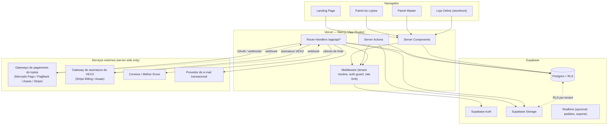

# VEXO — Arquitetura Técnica Oficial (PROMPT 22)

> Status: **proposta para aprovação — nenhuma funcionalidade foi implementada.**
> Este documento é o entregável da etapa de planejamento. Nenhum código de produção,
> schema SQL executável ou boilerplate de aplicação foi criado. Após aprovação,
> a implementação seguirá a ordem descrita na Seção 20, em PRs pequenos e revisáveis.

## Índice

0. [Auditoria do estado atual do projeto](#0-auditoria-do-estado-atual-do-projeto)
1. [Arquitetura geral](#1-arquitetura-geral)
2. [Diagrama dos principais componentes](#2-diagrama-dos-principais-componentes)
3. [Arquitetura multi-tenant](#3-arquitetura-multi-tenant)
4. [ERD conceitual](#4-erd-conceitual)
5. [Estrutura de tabelas](#5-estrutura-de-tabelas)
6. [Estratégia de RLS](#6-estratégia-de-rls)
7. [Estratégia de autenticação](#7-estratégia-de-autenticação)
8. [Estratégia de autorização (RBAC)](#8-estratégia-de-autorização-rbac)
9. [Estratégia de Storage](#9-estratégia-de-storage)
10. [Estratégia de APIs](#10-estratégia-de-apis)
11. [Estratégia de OAuth (pagamentos do lojista)](#11-estratégia-de-oauth-pagamentos-do-lojista)
12. [Estratégia de Webhooks](#12-estratégia-de-webhooks)
13. [Estratégia de Trial](#13-estratégia-de-trial)
14. [Estratégia de Assinaturas e Planos](#14-estratégia-de-assinaturas-e-planos)
15. [Pagamentos: VEXO vs. Lojista](#15-pagamentos-vexo-vs-lojista)
16. [Frete e Motoboy próprio](#16-frete-e-motoboy-próprio)
17. [Loja Online e Personalização](#17-loja-online-e-personalização)
18. [Estratégia de segurança](#18-estratégia-de-segurança)
19. [Estrutura de pastas](#19-estrutura-de-pastas)
20. [Estratégia de testes](#20-estratégia-de-testes)
21. [Observabilidade](#21-observabilidade)
22. [Estratégia de deploy](#22-estratégia-de-deploy)
23. [Variáveis de ambiente](#23-variáveis-de-ambiente)
24. [Ordem recomendada de implementação](#24-ordem-recomendada-de-implementação)

---

## 0. Auditoria do estado atual do projeto

### 0.1 O que existe hoje no repositório

O repositório `jonathagandrade-157/vexo` está, na prática, **vazio de código de aplicação**.
O único histórico é:

1. `589a400` — upload de `JAvendas-main (1).zip` (um projeto de terceiros, não relacionado à VEXO).
2. `42fc829` — remoção desse zip.

Não há `package.json`, não há app Next.js, não há schema de banco, não há Supabase configurado.
**Conclusão: este é um projeto greenfield.** Não existe dívida técnica de código para auditar —
a auditoria de "riscos e decisões" desta etapa recai sobre o material de referência (design) e
sobre as decisões de arquitetura que precisam ser tomadas *antes* da primeira linha de código.

### 0.2 O que existe como referência de produto (Stitch)

O arquivo `stitch_vexo_design_system.zip` traz **107 telas exportadas do Google Stitch**, cada uma
com `code.html` (HTML estático + Tailwind via CDN, sem framework, sem JS de aplicação, sem chamadas
de API) e `screen.png`. Também traz `vexo_design_system/DESIGN.md`, com os **design tokens oficiais**
(cores, tipografia, espaçamento, raio de borda, elevação).

Mapeando as 107 telas por domínio funcional, elas cobrem exatamente o escopo pedido no prompt:

| Domínio | Exemplos de telas | Módulo de arquitetura correspondente |
|---|---|---|
| Landing & aquisição | `landing_page_oficial_{desktop,mobile}`, `criar_conta_e_elegibilidade_trial`, `inicio_do_trial_sucesso`, `erro_trial_ja_utilizado` | Landing, Cadastro, Elegibilidade de Trial (§13) |
| Onboarding do lojista | `onboarding_boas_vindas`, `checklist`, `escolha_de_plano_trial`, `sobre_sua_marca`, `identidade_visual`, `produtos`, `pagamentos`, `frete`, `preview_da_loja`, `publicacao`, `vexo_ai`, `sucesso` | Wizard de setup (Painel do Lojista) |
| Painel do lojista — operação | `dashboard_principal`, `lista_de_produtos`, `adicionar_produto`, `categorias`, `controle_de_estoque`, `lista_de_pedidos`, `criar_pedido`, `detalhes_do_pedido`, `clientes`, `adicionar_cliente`, `detalhes_do_cliente`, `cupons` | Produtos, Categorias, Estoque, Pedidos, Clientes, Cupons (§5, §17) |
| Marketing & IA | `marketing`, `campanhas`, `automacoes`, `ai_marketing_spark`, `ai_sugestao_de_produto`, `ai_sugestao_de_estilo`, `ai_insights_e_relatorios`, `funil_de_conversao`, `origem_dos_clientes`, `desempenho_de_produtos`, `relatorio_de_vendas`, `relatorios_visao_geral` | Marketing, Analytics, Relatórios |
| Pagamentos & frete do lojista | `pagamentos`, `pagamentos_e_frete`, `frete_e_entregas`, `gestao_de_motoboy`, `gestao_de_entregas_mobile`, `rastreamento_de_entrega` | §11, §15, §16 |
| Personalização & configurações | `personalizacao_da_loja`, `escolha_de_temas`, `equipe_e_dominio`, `configuracoes_gerais`, `plano_e_seguranca` | §17, Domínios, Equipe/Permissões |
| Suporte (lojista) | `central_de_ajuda_lojista`, `meus_chamados_lojista`, `abrir_chamado_lojista`, `artigo_de_ajuda_lojista`, `conversa_do_chamado_lojista`, `suporte_mobile`, `chat_de_suporte_mobile` | Suporte |
| Painel Master | `master_visao_geral`, `master_gestao_de_lojas`, `master_detalhes_da_loja`, `master_assinaturas_e_faturamento`, `master_gestao_de_trials`, `master_seguranca_e_atividades`, `master_dashboard_de_suporte`, `master_gestao_de_chamados`, `master_detalhe_do_chamado` | Painel Master (§3, §14, §18) |
| Loja online (storefront) | `storefront_home`, `storefront_categoria`, `storefront_produto`, `storefront_carrinho`, `checkout_identificacao`, `checkout_pagamento`, `checkout_entrega`, `checkout_sucesso` | §17 |
| Estados de sistema | `trial_encerrado_estado`, `estados_do_sistema`, `estados_de_clientes`, `catalogo_vazio_desktop` | Empty states / error states (transversal) |

### 0.3 Riscos e decisões que a referência visual traz

- **HTML estático via `cdn.tailwindcss.com`**: não é código de produção reaproveitável diretamente —
  o Tailwind via CDN não compila, não faz *purge*, e as classes usam **nomes de cor arbitrários**
  gerados pelo Stitch (`surface-container-low`, `on-primary-fixed`, etc.) que batem com o
  `DESIGN.md`. **Decisão**: portar o `DESIGN.md` para `tailwind.config.ts` como fonte única de
  verdade de tema (cores, fontes, raio, espaçamento), e recriar cada tela como componente React
  usando essas mesmas classes semânticas — preservando 1:1 a identidade visual, sem redesenhar.
- **Imagens hospedadas em `lh3.googleusercontent.com`**: são placeholders do Stitch, não podem ir
  para produção. Precisam ser substituídas por Supabase Storage (uploads reais) ou por assets
  próprios da VEXO nas telas institucionais (landing, ícones da marca).
- **Fontes carregadas via Google Fonts (`fonts.googleapis.com`)**: ok para uso, mas devem ser
  carregadas via `next/font/google` (self-hosted pelo Next.js) para performance e para não
  depender de terceiro em runtime.
- **Nenhuma lógica de negócio nas telas**: os HTMLs são puramente visuais — não impõem nem
  contradizem nenhuma decisão de backend. Isso dá liberdade total para desenhar a arquitetura de
  dados e segurança do zero, sem "gambiarra" para encaixar em uma estrutura pré-existente.
- **Existência de telas "auditado"** (`dashboard_principal_auditado`, `master_visao_geral_auditado`,
  `storefront_home_auditado`) sugere que o próprio design já reservou estados para exibição de
  trilha de auditoria/compliance na UI — isso valida a necessidade de `audit_logs` desde o início
  (§18).

**Regra de execução**: nenhuma tela será redesenhada. A implementação vai consumir `code.html` +
`screen.png` de cada pasta como referência pixel-a-pixel e recriar em componentes React
com dados reais, no lugar do HTML estático.

---

## 1. Arquitetura geral

VEXO é um **SaaS multi-tenant** com três superfícies de produto sobre uma base de dados e
autorização compartilhada:

1. **App do Lojista + Painel Master** (autenticado, `app.vexo.com`) — Next.js App Router,
   renderização majoritariamente no servidor (RSC), mutações via Server Actions/Route Handlers.
2. **Loja Online / Storefront** (pública, `*.vexo.com` ou domínio próprio do lojista) — Next.js
   com SSR/ISR por tenant, otimizada para SEO e Core Web Vitals.
3. **Landing Page + Cadastro** (pública, marketing) — Next.js estático/ISR.

Todas as três superfícies compartilham o mesmo backend lógico (Supabase Postgres + Auth + Storage),
mas são **deployments/rotas isoladas** para permitir políticas de cache, autenticação e escala
diferentes (a loja pública tem tráfego totalmente diferente do painel autenticado).

Princípios não negociáveis:

- **Multi-tenant desde o primeiro commit** — nunca "adicionar tenant depois".
- **Segurança em profundidade**: RLS no banco é a última linha de defesa, não a única. Toda
  operação também é validada na camada de aplicação (Server Action / Route Handler) antes de
  chegar ao banco.
- **Nenhum segredo no cliente**: Server Components/Actions e Route Handlers são donos de qualquer
  chamada que exija credencial sensível (service role key, secrets de gateway de pagamento, etc.).
- **O design do Stitch é lei de UI**: a arquitetura de dados/API é desenhada para alimentar as
  telas existentes, não o contrário.

---

## 2. Diagrama dos principais componentes



Camadas de código (server-side), do domínio até a infraestrutura:

```
Route Handler / Server Action
        │  (valida sessão, tenant, permissão)
        ▼
   Service Layer (regra de negócio, orquestra múltiplos repositórios)
        │
        ▼
   Repository Layer (acesso a dados, único ponto que fala SQL/Supabase client)
        │
        ▼
   Supabase (Postgres + RLS)
```

Nenhuma tela ou componente client chama o Supabase diretamente para escrita de dados sensíveis;
leituras client-side (quando existirem, ex.: Realtime de pedidos) usam o client Supabase com a
`anon key`, protegida integralmente por RLS.

---

## 3. Arquitetura multi-tenant

### 3.1 Modelo escolhido: **single database, shared schema, isolado por RLS**

Avaliação das três opções clássicas:

| Estratégia | Isolamento | Custo operacional | Escala | Decisão |
|---|---|---|---|---|
| Banco por tenant | Máximo | Altíssimo (migração em N bancos, conexões) | Ruim para milhares de lojas pequenas | ❌ |
| Schema por tenant | Alto | Alto (DDL cresce com tenants, `search_path` complexo) | Médio | ❌ |
| **Tabela compartilhada + `tenant_id` + RLS** | Alto quando bem implementado | Baixo (uma migração serve todos) | Excelente (é o modelo do próprio Supabase para SaaS) | ✅ **Escolhido** |

Justificativa: a VEXO precisa suportar **muitas lojas pequenas/médias**, não poucas lojas gigantes.
O modelo compartilhado com RLS é o padrão recomendado pelo próprio Supabase para esse perfil, é o
que melhor equilibra isolamento forte + custo operacional baixo + facilidade de manutenção de
schema (uma única migration para todos os tenants). Se no futuro um tenant enterprise exigir
isolamento físico, ele pode ser migrado individualmente para um banco dedicado sem redesenhar o
resto do sistema — a modelagem por `tenant_id` já dá essa saída.

### 3.2 Resolução de tenant

- **Painel do lojista/master**: o tenant ativo vem da sessão (usuário pode pertencer a múltiplos
  tenants — `tenant_members`). Um seletor de loja na UI grava o tenant ativo em um cookie
  assinado (`vexo_active_tenant`), lido pelo Middleware em toda request.
- **Storefront**: o tenant é resolvido por **host** (subdomínio `loja.vexo.com` ou domínio
  próprio cadastrado em `domains`), nunca por dado enviado pelo cliente. O Middleware resolve
  `host → tenant_id` e injeta no contexto da request antes de qualquer leitura de dado.
- **Nunca confiar em `tenant_id` vindo do body/query do client.** Toda Server Action/Route Handler
  redetermina o tenant a partir da sessão (painel) ou do host (storefront), e essa é a fonte usada
  para consultar o banco — nunca o `tenant_id` que o formulário eventualmente carregue.

### 3.3 Isolamento por camada

| Camada | Mecanismo de isolamento |
|---|---|
| Banco (Postgres) | RLS obrigatório em toda tabela com `tenant_id` (§6) |
| Storage | Path prefixado por `tenant_id/...` + policy de bucket (§9) |
| API | Toda rota resolve o tenant a partir da sessão/host, nunca do payload (§10) |
| Webhooks recebidos | Assinatura do provedor + `tenant_id` resolvido pelo `external_account_id` cadastrado, nunca pelo payload cru (§12) |
| Cache/CDN | Chave de cache sempre inclui `tenant_id`/host |
| Background jobs | Todo job carrega `tenant_id` explícito, nunca itera "todos os registros" sem filtro |

---

## 4. ERD conceitual

Visão de alto nível por domínio (relacionamentos entre agregados, não todas as colunas —
detalhamento de campos na Seção 5):

```mermaid
erDiagram
    PROFILES ||--o{ TENANT_MEMBERS : "é membro"
    TENANTS ||--o{ TENANT_MEMBERS : "possui"
    TENANT_MEMBERS }o--|| ROLES : "tem papel"
    ROLES ||--o{ ROLE_PERMISSIONS : agrupa
    ROLE_PERMISSIONS }o--|| PERMISSIONS : referencia
    PROFILES ||--o{ PLATFORM_ADMINS : "pode ser MASTER"

    TENANTS ||--o{ PRODUCTS : possui
    TENANTS ||--o{ CATEGORIES : possui
    CATEGORIES ||--o{ PRODUCTS : classifica
    PRODUCTS ||--o{ PRODUCT_VARIANTS : possui
    PRODUCTS ||--o{ INVENTORY : controla
    PRODUCT_VARIANTS ||--o{ INVENTORY : controla

    TENANTS ||--o{ CUSTOMERS : possui
    CUSTOMERS ||--o{ ADDRESSES : possui
    TENANTS ||--o{ ORDERS : possui
    CUSTOMERS ||--o{ ORDERS : realiza
    ORDERS ||--o{ ORDER_ITEMS : contém
    PRODUCTS ||--o{ ORDER_ITEMS : referencia
    TENANTS ||--o{ COUPONS : possui
    ORDERS }o--o| COUPONS : aplica

    TENANTS ||--o{ PAYMENT_CREDENTIALS_VAULT : conecta
    ORDERS ||--o{ PAYMENTS : gera
    TENANTS ||--o{ SHIPPING_METHODS : configura
    TENANTS ||--o{ COURIERS : possui
    ORDERS ||--o| DELIVERY_ORDERS : gera
    DELIVERY_ORDERS }o--o| COURIERS : atribui

    TENANTS ||--|| STORE_SETTINGS : configura
    TENANTS ||--|| STORE_THEMES : personaliza
    TENANTS ||--o{ DOMAINS : registra

    TENANTS ||--o{ SUBSCRIPTIONS : assina
    PLANS ||--o{ SUBSCRIPTIONS : define
    SUBSCRIPTIONS ||--o{ SUBSCRIPTION_EVENTS : gera
    SUBSCRIPTIONS ||--o{ INVOICES : fatura
    TENANTS ||--o| TRIAL_RECORDS : possui

    TENANTS ||--o{ SUPPORT_TICKETS : abre
    SUPPORT_TICKETS ||--o{ SUPPORT_MESSAGES : contém

    TENANTS ||--o{ API_KEYS : gera
    TENANTS ||--o{ WEBHOOK_ENDPOINTS : configura
    WEBHOOK_ENDPOINTS ||--o{ WEBHOOK_DELIVERIES : registra

    TENANTS ||--o{ AUDIT_LOGS : registra
```



---

## 5. Estrutura de tabelas

Notação: `tenant_id` presente = tabela **isolada por tenant** (RLS obrigatória). Tabelas sem
`tenant_id` são **globais da plataforma** (planos, permissões, artigos de ajuda, admins).

### 5.1 Identidade, tenants e RBAC

| Tabela | Campos-chave | Notas |
|---|---|---|
| `profiles` | `id (=auth.users.id)`, `full_name`, `avatar_url`, `phone`, `created_at` | 1:1 com `auth.users`, criado via trigger no signup |
| `tenants` | `id`, `name`, `slug`, `status`, `document_hash`, `plan_id`, `created_by`, `created_at` | uma "loja"; `document_hash` = CPF/CNPJ com hash, nunca em texto puro aqui |
| `tenant_members` | `id`, `tenant_id`, `user_id`, `role_id`, `status`, `invited_by`, `created_at` | resolve N:N usuário↔loja (requisito §5 do prompt: um usuário pode ter acesso a múltiplas lojas) |
| `roles` | `id`, `tenant_id (nullable p/ papéis de sistema)`, `key`, `name`, `is_system` | `OWNER, ADMIN, MANAGER, OPERATOR, SUPPORT` como papéis de sistema; tenants podem clonar/customizar |
| `permissions` | `id`, `key` (`products.view`, `orders.update`, ...), `group` | catálogo fixo, seed via migration |
| `role_permissions` | `role_id`, `permission_id` | matriz RBAC (§8) |
| `platform_admins` | `id`, `user_id`, `role (MASTER, SUPPORT_AGENT)`, `created_at` | **tabela separada e sem `tenant_id`** — nunca misturar com `tenant_members` (requisito §5 do prompt) |

### 5.2 Catálogo e estoque

| Tabela | Campos-chave | Notas |
|---|---|---|
| `categories` | `id`, `tenant_id`, `parent_id`, `name`, `slug`, `position`, `image_path` | árvore simples via `parent_id` |
| `products` | `id`, `tenant_id`, `category_id`, `name`, `slug`, `description`, `price`, `compare_at_price`, `status`, `created_at` | |
| `product_variants` | `id`, `product_id`, `tenant_id`, `name`, `sku`, `price_override`, `attributes (jsonb)` | tamanho/cor etc. |
| `product_images` | `id`, `product_id`, `tenant_id`, `storage_path`, `position` | aponta para Supabase Storage |
| `inventory` | `id`, `tenant_id`, `product_id`, `variant_id (nullable)`, `quantity`, `reserved`, `low_stock_threshold` | reserva em pedido pendente evita overselling |

### 5.3 Vendas

| Tabela | Campos-chave | Notas |
|---|---|---|
| `customers` | `id`, `tenant_id`, `name`, `email`, `phone`, `document_hash`, `created_at` | cliente da **loja**, distinto de `profiles` (usuário da plataforma) |
| `addresses` | `id`, `tenant_id`, `customer_id`, `label`, `street`, `number`, `city`, `state`, `zip`, `is_default` | |
| `orders` | `id`, `tenant_id`, `customer_id`, `number`, `status`, `payment_status`, `fulfillment_status`, `subtotal`, `discount_total`, `shipping_fee`, `total`, `created_at` | `number` sequencial por tenant, não PK |
| `order_items` | `id`, `order_id`, `tenant_id`, `product_id`, `variant_id`, `name_snapshot`, `price_snapshot`, `qty` | snapshot evita que edição futura do produto altere pedidos antigos |
| `coupons` | `id`, `tenant_id`, `code`, `type (percent\|fixed)`, `value`, `usage_limit`, `usage_count`, `starts_at`, `ends_at`, `status` | |
| `order_coupons` | `order_id`, `coupon_id`, `discount_applied` | permite auditar valor aplicado mesmo se o cupom mudar depois |

### 5.4 Pagamentos (separados por domínio — ver §15)

| Tabela | Campos-chave | Notas |
|---|---|---|
| `store_payment_providers` | `id`, `tenant_id`, `provider`, `status`, `connected_account_id`, `created_at` | metadado público da conexão (sem segredo) |
| `payment_credentials_vault` | `id`, `tenant_id`, `provider`, `encrypted_access_token`, `encrypted_refresh_token`, `expires_at` | **acesso só via service role**; RLS nega tudo para `anon`/`authenticated` |
| `payments` | `id`, `tenant_id`, `order_id`, `provider`, `external_id`, `status`, `amount`, `method`, `paid_at` | pagamento do **cliente final** para a loja |
| `plans` | `id`, `code (starter\|pro\|business)`, `name`, `price_month`, `price_year`, `limits (jsonb)`, `features (jsonb)`, `status` | tabela global; único lugar onde limites existem (requisito §9 do prompt) |
| `subscriptions` | `id`, `tenant_id`, `plan_id`, `status`, `current_period_end`, `cancel_at_period_end`, `provider`, `external_subscription_id` | assinatura do **lojista com a VEXO** |
| `subscription_events` | `id`, `subscription_id`, `type`, `metadata (jsonb)`, `created_at` | trilha de upgrade/downgrade/cancelamento |
| `invoices` | `id`, `tenant_id`, `subscription_id`, `amount`, `status`, `due_date`, `paid_at`, `external_invoice_id` | faturas da assinatura VEXO |

### 5.5 Trial

| Tabela | Campos-chave | Notas |
|---|---|---|
| `trial_eligibility` | `id`, `document_hash (unique)`, `first_tenant_id`, `created_at` | HMAC do CPF/CNPJ com segredo do servidor; nunca expõe o documento (§13) |
| `trial_records` | `id`, `tenant_id (unique)`, `started_at`, `ends_at`, `status (active\|converted\|expired)`, `converted_plan_id`, `converted_at` | |

### 5.6 Frete e entrega (ver §16)

| Tabela | Campos-chave | Notas |
|---|---|---|
| `shipping_methods` | `id`, `tenant_id`, `type (correios\|melhor_envio\|carrier\|pickup\|own_courier)`, `config (jsonb)`, `status` | |
| `delivery_zones` | `id`, `tenant_id`, `name`, `cep_ranges (jsonb)`, `fee`, `eta_minutes` | usado pelo motoboy próprio |
| `couriers` | `id`, `tenant_id`, `name`, `phone`, `vehicle_type`, `status` | |
| `delivery_orders` | `id`, `tenant_id`, `order_id`, `courier_id (nullable)`, `status`, timestamps por etapa | status: `pending → accepted → preparing → out_for_delivery → delivered / cancelled` |

### 5.7 Loja, personalização e domínio

| Tabela | Campos-chave | Notas |
|---|---|---|
| `store_settings` | `id`, `tenant_id (unique)`, `business_hours (jsonb)`, `contact_info (jsonb)`, `checkout_config (jsonb)`, `seo (jsonb)` | |
| `store_themes` | `id`, `tenant_id (unique)`, `logo_path`, `favicon_path`, `colors (jsonb)`, `fonts (jsonb)`, `layout (jsonb)`, `sections (jsonb)`, `version` | `jsonb` estruturado com schema validado na aplicação — **nunca HTML arbitrário** (requisito §16 do prompt) |
| `domains` | `id`, `tenant_id`, `hostname (unique)`, `type (subdomain\|custom)`, `status`, `verification_token`, `ssl_status` | |

### 5.8 Integrações, API e Webhooks

| Tabela | Campos-chave | Notas |
|---|---|---|
| `integrations` | `id`, `tenant_id`, `type`, `status`, `config (jsonb, não sensível)`, `credentials_vault_ref` | segredos ficam em `payment_credentials_vault`-like vault, nunca aqui |
| `api_keys` | `id`, `tenant_id`, `name`, `hashed_key`, `scopes (text[])`, `last_used_at`, `status` | chave em texto puro só é exibida uma vez na criação |
| `webhook_endpoints` | `id`, `tenant_id`, `url`, `secret_hash`, `events (text[])`, `status` | webhooks que **a VEXO envia** para o lojista |
| `webhook_deliveries` | `id`, `webhook_endpoint_id`, `event_type`, `payload (jsonb)`, `status`, `attempt_count`, `last_attempt_at`, `response_code` | idempotência via `event_id` único |

### 5.9 Suporte, notificações e auditoria

| Tabela | Campos-chave | Notas |
|---|---|---|
| `support_tickets` | `id`, `tenant_id`, `opened_by`, `subject`, `status`, `priority`, `category`, `assigned_agent_id`, `created_at` | |
| `support_messages` | `id`, `ticket_id`, `tenant_id`, `sender_type (lojista\|master\|system)`, `sender_id`, `body`, `attachments (jsonb)`, `created_at` | |
| `help_articles` | `id`, `slug`, `title`, `body`, `category`, `status`, `published_at` | global, sem `tenant_id` |
| `notifications` | `id`, `tenant_id (nullable)`, `user_id`, `type`, `payload (jsonb)`, `read_at`, `created_at` | |
| `audit_logs` | `id`, `tenant_id (nullable p/ ações de MASTER)`, `actor_user_id`, `actor_type`, `action`, `resource_type`, `resource_id`, `metadata (jsonb)`, `ip`, `user_agent`, `created_at` | **append-only**: sem UPDATE/DELETE permitido, nem para OWNER |
| `daily_store_metrics` | `tenant_id`, `date`, `visits`, `orders_count`, `revenue`, `conversion_rate` | agregação para os dashboards de analytics/relatórios, calculada por job |

**Total: ~34 tabelas de negócio + tabelas do `auth` schema do Supabase.** Todas as tabelas com
`tenant_id` têm índice composto `(tenant_id, id)` e FK `tenant_id → tenants(id) ON DELETE RESTRICT`
(nunca CASCADE em dados financeiros/pedidos — exclusão de loja é um fluxo controlado, não um DROP).

---

## 6. Estratégia de RLS

RLS é **obrigatória e habilitada por padrão** (`ENABLE ROW LEVEL SECURITY` + `FORCE ROW LEVEL
SECURITY`) em toda tabela de negócio. Nenhuma tabela fica com RLS desabilitada "temporariamente".

### 6.1 Funções auxiliares (security definer, no schema `auth`/`private`)

- `private.is_tenant_member(tenant_id uuid) returns boolean` — verifica se `auth.uid()` está em
  `tenant_members` com `status = 'active'` para aquele tenant.
- `private.has_permission(tenant_id uuid, perm_key text) returns boolean` — resolve
  `tenant_members → roles → role_permissions → permissions` para o usuário atual.
- `private.is_platform_admin() returns boolean` — verifica `platform_admins` para `auth.uid()`.
- `private.is_platform_support() returns boolean` — variante restrita a `SUPPORT_AGENT`.

Essas funções são `security definer` para poder ler tabelas de RBAC sem expor policies
recursivas complexas em cada tabela de negócio.

### 6.2 Padrão de policy por tabela tenant-scoped

```sql
-- Exemplo ilustrativo (não é DDL final) para "products"
create policy "tenant members can select products"
  on public.products for select
  using ( private.is_tenant_member(tenant_id) or private.is_platform_admin() );

create policy "users with products.create can insert"
  on public.products for insert
  with check ( private.has_permission(tenant_id, 'products.create') );

create policy "users with products.update can update"
  on public.products for update
  using ( private.has_permission(tenant_id, 'products.update') )
  with check ( tenant_id = (select tenant_id from public.products where id = products.id) );
```

Regras gerais:

- **SELECT**: liberado a qualquer membro ativo do tenant (granularidade fina de leitura é raro
  precisar; quando precisar — ex. `payment_credentials_vault` — a policy é `using (false)` e o
  acesso só ocorre via `service_role`, que ignora RLS).
- **INSERT/UPDATE/DELETE**: sempre gated por `has_permission(tenant_id, 'recurso.acao')`, nunca só
  por "é membro do tenant".
- **MASTER**: enxerga tudo via `is_platform_admin()`, mas **toda leitura de MASTER passa por
  `audit_logs`** (ação registrada), e MASTER não tem policy de escrita direta em dados
  operacionais do lojista (produtos, pedidos) — apenas em tabelas de administração da plataforma
  (`tenants.status`, `trial_records`, `subscriptions`, `support_tickets`).
- **Tabelas de vault/segredo**: `using (false)` para `anon`/`authenticated` — únicas leitoras são
  Route Handlers usando a `service_role key`, nunca exposta ao browser.
- **`audit_logs`**: policy de INSERT só para `service_role` (via trigger/Route Handler), sem
  policy de UPDATE/DELETE para ninguém.

### 6.3 Testes de RLS

RLS é tratada como contrato testável, não como configuração "e esperar que funcione" — ver §20
(testes de isolamento multi-tenant rodando com `service_role` para setup e `authenticated` com
JWT de tenants diferentes para validar negação de acesso cruzado).

---

## 7. Estratégia de autenticação

- **Supabase Auth** para `profiles` (usuários da plataforma: lojistas, equipe, MASTER) — e-mail/senha
  + OAuth social (Google) como opção. MFA (TOTP) disponível para contas MASTER e OWNER (obrigatório
  para MASTER).
- **Sessão via cookies HTTP-only** (`@supabase/ssr`), nunca `localStorage`, para mitigar XSS
  roubando token de sessão.
- **Clientes da loja (`customers`)** no checkout **não** usam necessariamente Supabase Auth no MVP —
  fluxo de "identificação" (nome/e-mail/telefone) sem senha, como já sugerem as telas
  `checkout_identificacao`. Conta de cliente com login (para "meus pedidos") é uma evolução
  posterior, usando Supabase Auth em um *tenant de audiência* separado do `profiles` administrativo.
- **Middleware** (`middleware.ts`) refresca a sessão em toda request e resolve:
  1. usuário autenticado (ou não) a partir do cookie;
  2. tenant ativo (painel) ou tenant por host (storefront);
  3. redireciona para login/trial-encerrado/onboarding conforme o estado (telas
     `trial_encerrado_estado`, `erro_trial_ja_utilizado` já preveem esses redirects).
- **Convite de equipe** (`vexo_equipe_e_dominio`): fluxo de convite por e-mail gera um registro
  `tenant_members(status='invited')` com token de convite assinado e expiração; aceite cria/associa
  o `auth.users` e muda status para `active`.

---

## 8. Estratégia de autorização (RBAC)

Duas camadas, sempre as duas juntas — nunca uma sozinha:

1. **RLS no banco** (§6) — última linha de defesa, impossível de contornar mesmo com bug de
   aplicação.
2. **Guard na aplicação** (Server Action/Route Handler) — falha rápido, com mensagem de erro
   amigável, antes de bater no banco; também é onde se valida regra de negócio que RLS não
   expressa bem (ex.: limite de `products_limit` do plano).

Papéis de sistema e mapeamento inicial de permissões (a matriz completa fica em uma migration de
seed, não hardcoded em código de UI):

| Papel | Descrição | Exemplo de permissões |
|---|---|---|
| `OWNER` | Dono da loja, criador do tenant | todas as permissões do tenant, incluindo `billing.manage`, `team.manage` |
| `ADMIN` | Administrador de confiança do OWNER | tudo exceto billing e exclusão do tenant |
| `MANAGER` | Gestão operacional (produtos, pedidos, marketing) | `products.*`, `orders.*`, `customers.*`, `coupons.*` |
| `OPERATOR` | Operação do dia a dia (expedição, atendimento) | `orders.view`, `orders.update`, `customers.view` |
| `SUPPORT` | Suporte interno da VEXO alocado à loja (raro, temporário) | `support.view`, leitura limitada |
| `MASTER` | Equipe VEXO — plataforma inteira | gestão de tenants, planos, trials, billing da VEXO, suporte |

Chaves de permissão seguem `recurso.acao` (`products.view`, `products.create`, `products.update`,
`products.delete`, `orders.view`, `orders.update`, `customers.view`, `customers.update`,
`settings.view`, `settings.update`, `team.view`, `team.manage`, `billing.view`, `billing.manage`,
`support.view`, `support.manage`, ...) exatamente como listado no prompt — isso vira o catálogo de
`permissions` (seed) e é checado tanto na policy RLS quanto no guard de aplicação (um único source
of truth: a tabela `role_permissions`, lida por ambas as camadas).

---

## 9. Estratégia de Storage

Buckets do Supabase Storage, todos **privados por padrão**, acesso via URL assinada de curta
duração ou via proxy do servidor quando aplicável:

| Bucket | Conteúdo | Path convention | Público? |
|---|---|---|---|
| `product-media` | imagens de produto | `{tenant_id}/products/{product_id}/{file}` | público de leitura (necessário para storefront/SEO), escrita restrita |
| `store-branding` | logo, favicon, banners do tema | `{tenant_id}/branding/{file}` | público de leitura, escrita restrita |
| `support-attachments` | anexos de chamados | `{tenant_id}/tickets/{ticket_id}/{file}` | privado, URL assinada |
| `platform-assets` | assets institucionais (landing, e-mail) | `platform/{file}` | público |

Policy padrão de Storage (ilustrativa):

```sql
-- Exemplo ilustrativo de policy de bucket privado
create policy "tenant members manage own files"
  on storage.objects for all
  using (
    bucket_id = 'support-attachments'
    and private.is_tenant_member( (storage.foldername(name))[1]::uuid )
  );
```

Regras:

- O **primeiro segmento do path é sempre `tenant_id`** — a policy deriva o tenant do próprio path,
  nunca de metadado enviável pelo client.
- Upload sempre passa por **validação de tipo/tamanho no servidor** (Route Handler ou Server
  Action assinando a URL de upload), nunca upload direto do browser sem checagem.
- Buckets públicos (produto, branding) ainda usam path por tenant — "público" aqui significa
  "leitura sem autenticação necessária para a loja funcionar", não "sem isolamento": um tenant
  nunca tem permissão de **escrever** no path de outro.

---

## 10. Estratégia de APIs

Quatro superfícies de API, com autenticação e finalidade distintas:

| Superfície | Rota | Auth | Consumidor |
|---|---|---|---|
| **Server Actions** | `app/**/actions.ts` | sessão Supabase (cookie) | Formulários do próprio Next.js (painel, storefront) |
| **API privada (BFF)** | `/api/internal/*` | sessão Supabase (cookie) | Chamadas client-side do próprio app (ex.: busca com debounce, upload) |
| **API pública** | `/api/v1/*` | `api_keys` (Bearer, hash comparado no servidor) | Integrações externas do lojista (futuro) |
| **Webhooks recebidos** | `/api/webhooks/{provider}` | assinatura HMAC do provedor | Gateways de pagamento, transportadoras |

Regras comuns a todas:

- Toda rota resolve `tenant_id` a partir de **sessão** ou **API key**, nunca de parâmetro de
  rota/body sem cruzar com o dono autenticado (mitiga IDOR/tenant escape).
- Rate limiting por IP + por tenant nas rotas públicas (`/api/v1/*`, `/api/webhooks/*`, login).
- Toda mutação valida com schema (Zod) antes de tocar no service layer — mitiga mass assignment
  (o schema define a allowlist de campos aceitos, nunca um `...body` genérico gravado no banco).
- Versionamento de API pública via prefixo de rota (`/api/v1/`) desde o início, para evitar breaking
  changes silenciosos quando a API pública for lançada.

---

## 11. Estratégia de OAuth (pagamentos do lojista)

Cada lojista conecta sua própria conta em Mercado Pago, PagBank, Asaas ou Stripe. Fluxo:

1. Lojista clica "Conectar" na tela `pagamentos_desktop`/`pagamentos_e_frete_desktop`.
2. Server Action gera `state` assinado (contendo `tenant_id` + nonce) e redireciona para a tela de
   autorização OAuth do provedor.
3. Provedor redireciona para `/api/oauth/{provider}/callback` (Route Handler) com `code` + `state`.
4. Route Handler valida `state`, troca `code` por `access_token`/`refresh_token` **inteiramente no
   servidor**, criptografa e grava em `payment_credentials_vault` (nunca em texto puro, nunca
   retornado ao browser).
5. `store_payment_providers` só guarda metadado não sensível (provider, status, `connected_account_id`)
   — é isso que a UI lê para mostrar "Mercado Pago conectado ✅".
6. Renovação de token (quando o provedor usa `refresh_token`) roda em job server-side, nunca
   disparada pelo cliente.

Provedores sem OAuth completo (alguns fluxos de Asaas/PagBank usam API key em vez de OAuth): mesma
regra vale — a chave é colada em um formulário que envia via Server Action para o Route Handler,
que criptografa e grava no vault; **nunca fica em um client component nem é logada**.

---

## 12. Estratégia de Webhooks

### 12.1 Webhooks que a VEXO recebe (gateways, Correios/Melhor Envio, billing)

- Endpoint dedicado por provedor: `/api/webhooks/mercadopago`, `/api/webhooks/stripe-billing`, etc.
- Validação de assinatura HMAC/segredo do provedor **antes** de qualquer parsing de negócio.
- Idempotência: `event_id` do provedor gravado em uma tabela de dedupe (`webhook_deliveries` ou
  equivalente de entrada) — reprocessar o mesmo evento é no-op.
- Resolução de tenant pelo `connected_account_id`/`external_id` já cadastrado, nunca por campo
  livre do payload.
- Processamento assíncrono quando a ação for pesada (o Route Handler responde `200` rápido e
  enfileira o processamento, para evitar retry agressivo do provedor por timeout).

### 12.2 Webhooks que a VEXO envia (para integrações do lojista)

- Lojista cadastra `webhook_endpoints` com URL + escolhe eventos (`order.created`, `order.paid`,
  `order.shipped`, `order.delivered`, `order.cancelled`, `product.created`, `product.updated`,
  `customer.created`, `payment.updated`, `subscription.updated`, ...).
- Cada envio é assinado com HMAC-SHA256 usando `secret_hash` do endpoint, no header
  `X-Vexo-Signature`, para o lojista poder validar autenticidade.
- Retry com backoff exponencial (ex.: 1m, 5m, 30m, 2h, 12h), status e tentativas registrados em
  `webhook_deliveries`; após N falhas, endpoint marcado `status = 'failing'` e lojista notificado.
- Payload inclui `event_id` único para o consumidor implementar idempotência do lado dele também.

Não implementado nesta etapa (conforme instrução do prompt) — apenas arquitetura definida acima.

---

## 13. Estratégia de Trial

Regras de negócio: 30 dias grátis, sem cartão, ativação de plano a qualquer momento, um trial por
CPF/CNPJ, sem expor o documento.

Arquitetura de elegibilidade (não confiar só no CPF puro):

1. No cadastro, o CPF/CNPJ informado é normalizado e transformado em `document_hash = HMAC-SHA256(
   documento_normalizado, TRIAL_HASH_SECRET)` — segredo só existe no servidor
   (`TRIAL_HASH_SECRET`, variável privada). O documento em texto puro **não é persistido** em
   `trial_eligibility` (se for necessário guardá-lo em algum lugar por obrigação fiscal futura, vai
   em uma tabela separada e criptografada, fora do fluxo de elegibilidade).
2. Antes de criar o trial, o servidor verifica se já existe uma linha em `trial_eligibility` com
   aquele `document_hash`. Se existir → fluxo de erro (`erro_trial_ja_utilizado`), aponta o
   `first_tenant_id` para o lojista entender que já usou.
3. Sinais adicionais de elegibilidade (para reduzir fraude por CPF "emprestado"/gerado), avaliados
   no servidor e nunca expostos como regra explícita ao cliente:
   - normalização + checagem de dígito verificador do CPF/CNPJ;
   - correlação leve por `user_id` (mesma conta não abre 2º trial mesmo com CPF diferente) via
     índice único em `trial_records.tenant_id` + verificação de `tenants.created_by`;
   - opcional/fase 2: correlação por device fingerprint ou IP para casos abusivos, avaliado com
     cautela para não gerar falsos positivos.
4. `trial_records` guarda `started_at`, `ends_at (started_at + 30 dias)`, `status`. Um job diário
   (cron) varre trials com `ends_at < now()` e `status = 'active'`, muda para `expired`, e a
   aplicação passa a bloquear recursos pagos (`trial_encerrado_estado`) via checagem central de
   "acesso liberado" (ver 13.1).
5. Ativar um plano antes do fim do trial cria a `subscription` e marca `trial_records.status =
   'converted'` — não há downtime nem re-onboarding.

### 13.1 Ponto único de verificação de acesso

Toda a aplicação (painel, storefront, APIs) consulta uma função central
`private.tenant_access_status(tenant_id)` (retorna `trialing | active | expired | suspended`), em
vez de cada tela checar `trial_records`/`subscriptions` isoladamente — evita a inconsistência de
"esqueci de checar trial nessa tela nova".

---

## 14. Estratégia de Assinaturas e Planos

- Planos (`Starter`, `Pro`, `Business`) são dados, não código: `plans.limits` (jsonb) guarda
  `products_limit`, `users_limit`, `storage_limit_mb`, `orders_limit`, etc., e `plans.features`
  guarda flags (`custom_domain`, `own_courier`, `api_access`, ...). Nenhum limite fica hardcoded em
  componente/Server Action — toda checagem de limite lê o plano ativo do tenant.
- `subscriptions` é o estado atual (1 por tenant); `subscription_events` é o histórico imutável
  (upgrade, downgrade, cancelamento, reativação, falha de pagamento) — a UI do Master
  (`master_assinaturas_e_faturamento`) lê `subscription_events` para a timeline.
- Ciclo de vida: `trialing → active → past_due (falha de cobrança) → active (recuperado) |
  canceled`. `cancel_at_period_end` permite cancelamento sem cortar acesso no meio do período já
  pago.
- Cobrança da assinatura em si (VEXO cobrando o lojista) é tratada como um gateway próprio,
  desacoplado dos gateways que o lojista conecta para vender (ver §15) — provedor único definido
  pela VEXO (ex.: Stripe Billing ou Asaas), com webhook dedicado (`/api/webhooks/vexo-billing`).
- Downgrade que viola limite atual (ex.: tenant tem 50 produtos e cai para plano com limite de 20)
  não deleta dados — bloqueia criação de novos recursos até o lojista se adequar, e sinaliza no
  painel (mesmo princípio de "não implementar solução improvisada": trava criação, não trunca
  dado do cliente).

---

## 15. Pagamentos: VEXO vs. Lojista

Dois fluxos financeiros completamente separados, sem tabelas ou credenciais compartilhadas:

| | Pagamento do cliente final → loja | Assinatura do lojista → VEXO |
|---|---|---|
| Tabelas | `payments`, `payment_credentials_vault`, `store_payment_providers` | `subscriptions`, `invoices`, `subscription_events` |
| Quem conecta a credencial | O lojista (OAuth, §11) | A VEXO (conta própria com o gateway de billing) |
| Webhook | `/api/webhooks/{provider}` por gateway do lojista | `/api/webhooks/vexo-billing` |
| Quem vê o quê | Lojista vê seus próprios `payments` (RLS por tenant) | Lojista vê sua própria `subscription`/`invoices`; MASTER vê todas |
| Dinheiro | Vai para a conta do lojista no gateway dele | Vai para a conta da VEXO |

Essa separação evita um dos riscos mais comuns em SaaS de e-commerce: misturar o dinheiro do
cliente final com a receita da plataforma, o que complicaria compliance, conciliação e — mais
grave — criaria uma superfície de ataque onde comprometer a assinatura poderia vazar para as
vendas da loja (ou vice-versa).

---

## 16. Frete e Motoboy próprio

- `shipping_methods` guarda a configuração por tenant para Correios, Melhor Envio, transportadora
  manual, retirada e motoboy próprio — cada `type` tem seu `config (jsonb)` com schema específico
  validado na aplicação.
- Cálculo de frete em tempo real (Correios/Melhor Envio) acontece em um Route Handler server-side
  (`/api/shipping/quote`) que chama a API externa com a credencial da VEXO ou do lojista (conforme
  contrato do provedor) — nunca do client direto, para não expor a chave e para poder cachear
  cotações.
- **Motoboy próprio** é seu próprio sub-domínio dentro do sistema:
  - `couriers`: cadastro dos entregadores do lojista.
  - `delivery_zones`: área de cobertura + taxa, usado no checkout para decidir se motoboy próprio
    está disponível para aquele CEP.
  - `delivery_orders`: uma entrega por pedido elegível, com máquina de estados
    `pending → accepted → preparing → out_for_delivery → delivered` (+ `cancelled` em qualquer
    ponto antes de `delivered`), espelhando exatamente as telas `gestao_de_motoboy_desktop`,
    `gestao_de_entregas_mobile` e `rastreamento_de_entrega_desktop`.
  - `courier_assignments`: histórico de atribuição (permite reatribuir sem perder rastro).
- Não implementado nesta etapa — arquitetura registrada para a fase correspondente do roadmap (§24).

---

## 17. Loja Online e Personalização

- Cada domínio (subdomínio `*.vexo.com` ou domínio próprio em `domains`) resolve, via Middleware,
  o `tenant_id` e carrega **apenas** `store_settings` + `store_themes` daquele tenant — nenhuma
  query de storefront roda sem o filtro de tenant vindo do host.
- `store_themes.colors/fonts/layout/sections` é **JSON estruturado com schema validado**
  (Zod), populando os tokens do `DESIGN.md` (§0.3) por tenant — nunca HTML/CSS arbitrário
  salvo pelo lojista, o que eliminaria uma classe inteira de XSS estored no storefront público.
  "Seções" da home (banner, vitrine, texto) são compostas a partir de um catálogo fechado de
  blocos pré-construídos, cada um com props tipadas.
- Layout, tema escuro, tipografia (Hanken Grotesk/Inter/JetBrains Mono), espaçamento de 8px e
  raio de 4/8px do `DESIGN.md` viram o `tailwind.config.ts` base do projeto — reaproveitado tanto
  no painel quanto no storefront, com a paleta de cor podendo variar por tenant dentro dos limites
  definidos pelo plano (ex.: Starter usa tema padrão; Pro/Business liberam cor customizada).
- Renderização: SSR/ISR por tenant no storefront (Next.js `generateStaticParams`/revalidate por
  tag), para SEO e performance, com invalidação de cache disparada quando o lojista publica
  alteração de produto/tema (`revalidateTag` no Server Action de salvar).

---

## 18. Estratégia de segurança

| Ameaça | Mitigação |
|---|---|
| SQL Injection | Nunca SQL concatenado — apenas client Supabase/query builder parametrizado; nenhuma query dinâmica monta string de SQL a partir de input |
| XSS | React escapa por padrão; temas não aceitam HTML/CSS arbitrário (§17); sanitização explícita em qualquer campo rich-text (descrição de produto) com allowlist de tags |
| CSRF | Server Actions do Next.js já mitigam via same-origin checks nativos; Route Handlers de mutação exigem método não-GET + verificação de origin |
| IDOR | Todo recurso é buscado com `WHERE tenant_id = :tenant_atual AND id = :id` (nunca só `id`); RLS reforça mesmo se a aplicação esquecer o filtro |
| Broken Access Control | RBAC checado em aplicação + RLS (§8); testes automatizados de permissão (§20) |
| Tenant escape | Tenant sempre resolvido no servidor (sessão/host), nunca aceito do client (§3.2); RLS como rede de segurança final |
| Exposição de tokens/secrets | Vault dedicado, `service_role key` só em server, nunca em `NEXT_PUBLIC_*` (§23) |
| Mass assignment | Toda mutação valida contra schema Zod com allowlist explícita de campos |
| Rate abuse | Rate limiting por IP/tenant em login, checkout, API pública e webhooks recebidos |
| Webhook spoofing | Validação de assinatura HMAC do provedor antes de processar (§12) |
| Replay attacks | `event_id` idempotente nos webhooks; nonce + expiração no `state` do OAuth |
| Session abuse | Cookies HTTP-only + `Secure` + `SameSite=Lax`; refresh de sessão centralizado no Middleware; MFA para MASTER |

Complementar: `pnpm audit`/Dependabot no CI, cabeçalhos de segurança (CSP, `X-Frame-Options`,
`Strict-Transport-Security`) configurados no Next.js, e revisão de PR obrigatória antes de merge em
`main` (§ fluxo de branches abaixo).

---

## 19. Estrutura de pastas

Proposta para o Next.js App Router, organizada por **feature** (não por tipo de arquivo solto),
para que "tudo sobre pedidos" fique junto e a segurança (quem pode ler/escrever) seja visível no
mesmo lugar do domínio — reduz o risco de um Server Action esquecer uma checagem porque ela "mora"
longe da regra de negócio que a exige.

```
vexo/
├── app/
│   ├── (marketing)/                # Landing page pública, sem sessão
│   │   └── page.tsx
│   ├── (auth)/                     # Login, cadastro, elegibilidade de trial
│   │   ├── login/
│   │   └── cadastro/
│   ├── (dashboard)/                 # Painel do lojista — exige sessão + tenant ativo
│   │   ├── layout.tsx               # resolve tenant ativo, injeta contexto
│   │   ├── produtos/
│   │   ├── pedidos/
│   │   ├── clientes/
│   │   ├── cupons/
│   │   ├── marketing/
│   │   ├── frete/
│   │   ├── personalizacao/
│   │   ├── equipe/
│   │   └── configuracoes/
│   ├── (master)/                    # Painel Master — exige platform_admins
│   │   ├── layout.tsx
│   │   ├── lojas/
│   │   ├── trials/
│   │   ├── assinaturas/
│   │   └── suporte/
│   ├── (storefront)/                # Loja pública — resolvida por host
│   │   ├── layout.tsx
│   │   ├── page.tsx                 # home
│   │   ├── [categoria]/
│   │   ├── produto/[slug]/
│   │   └── checkout/
│   └── api/
│       ├── internal/                # BFF autenticado por sessão
│       ├── v1/                      # API pública (api_keys)
│       ├── oauth/{provider}/        # callbacks OAuth de pagamento
│       └── webhooks/{provider}/     # webhooks recebidos
│
├── features/                        # Lógica de domínio, por feature
│   ├── products/
│   │   ├── actions.ts                # Server Actions (guard de permissão aqui)
│   │   ├── service.ts                 # regra de negócio
│   │   ├── repository.ts              # única camada que fala com Supabase
│   │   ├── schema.ts                  # Zod (mesma fonte usada em client e server)
│   │   └── components/                # componentes específicos da feature
│   ├── orders/
│   ├── customers/
│   ├── trial/
│   ├── billing/
│   ├── shipping/
│   ├── theming/
│   └── support/
│
├── components/                      # UI compartilhada, sem regra de negócio
│   └── ui/                          # componentes derivados do design system (§0.3)
│
├── lib/
│   ├── supabase/
│   │   ├── server.ts                 # client server (cookies, service role quando aplicável)
│   │   └── client.ts                 # client browser (anon key)
│   ├── auth/                         # helpers de sessão, tenant ativo, RBAC guard
│   ├── security/                     # rate limit, HMAC, criptografia do vault
│   └── env.ts                        # validação tipada de variáveis de ambiente
│
├── middleware.ts                     # resolve tenant (host/cookie), guarda de sessão
│
├── supabase/
│   ├── migrations/                   # schema SQL versionado
│   └── seed/                         # seed de permissions/plans/roles
│
├── types/                            # tipos compartilhados (gerados do Supabase + domínio)
│
└── tests/
    ├── unit/
    ├── integration/
    └── e2e/
```

Motivo da divisão `app/` (rotas) vs. `features/` (domínio): o Next.js App Router incentiva colocar
tudo dentro de `app/`, mas isso mistura roteamento com regra de negócio e dificulta reuso entre
painel/API pública/webhook (ex.: "criar pedido" precisa da mesma regra vinda do checkout e de uma
futura API pública — `features/orders/service.ts` é chamado por ambos). `app/` fica fino
(roteamento + composição de UI), `features/` concentra a lógica testável.

---

## 20. Estratégia de testes

| Tipo | Ferramenta sugerida | Foco |
|---|---|---|
| Unit | Vitest | `service.ts`/`schema.ts` de cada feature, cálculo de frete/desconto/limite de plano |
| Integration | Vitest + Supabase local (CLI) | Repository layer contra Postgres real, migrations aplicadas |
| RLS / isolamento multi-tenant | Vitest + Supabase local, JWTs de tenants distintos | Tenant A nunca lê/escreve dado do Tenant B em nenhuma tabela — suite dedicada, roda a cada PR que toca `supabase/migrations` |
| Permissões (RBAC) | Vitest | Cada papel só realiza as ações permitidas pela matriz de `role_permissions` |
| Pagamentos | Vitest + mocks dos gateways / sandbox oficial | Fluxo de OAuth, webhook, idempotência, falha de pagamento |
| Webhooks | Vitest | Assinatura inválida rejeitada, replay é no-op, retry/backoff |
| E2E | Playwright | Fluxos críticos: cadastro→trial→onboarding→publicar loja; checkout completo; convite de equipe |
| Segurança | `pnpm audit`/Dependabot + revisão manual dirigida por §18 | Dependências vulneráveis, headers, checklist de OWASP no PR de features sensíveis |

CI (GitHub Actions) roda lint + typecheck + unit + integration + RLS a cada PR; E2E roda em PRs
que tocam `app/(storefront)` ou `app/(dashboard)` critical paths, e no merge para `main`.

---

## 21. Observabilidade

- **Logs estruturados** (JSON) em Route Handlers/Server Actions, com `tenant_id`, `user_id`,
  `request_id` — nunca corpo de request bruto (pode conter dado sensível) nem segredos.
- **Erros**: Sentry (ou equivalente) capturando exceptions server e client, com PII minimizada
  (sem CPF/CNPJ, sem token).
- **Performance**: Vercel Analytics/Speed Insights para Core Web Vitals do storefront (crítico para
  SEO/conversão da loja pública).
- **Auditoria de negócio**: `audit_logs` (§5.9) é a fonte de verdade para "quem fez o quê", separada
  de log técnico — alimenta a tela `master_seguranca_e_atividades_desktop`.
- **Pagamentos/Webhooks**: dashboard interno (Master) lendo `webhook_deliveries` e `payments` para
  monitorar taxa de falha e latência de processamento.
- **Autenticação**: eventos de login falho/sucesso, reset de senha e MFA registrados em
  `audit_logs` com `actor_type='user'`.

---

## 22. Estratégia de deploy

- **Vercel** hospeda o único projeto Next.js (monorepo simples, sem necessidade de micro-frontends
  no MVP); os *route groups* `(marketing)`, `(dashboard)`, `(master)`, `(storefront)` compartilham o
  mesmo build, mas o Middleware aplica políticas de cache/headers diferentes por grupo.
- **Ambientes**: `Preview` (todo PR ganha uma URL própria, banco Supabase de staging compartilhado
  com schema idêntico ao de produção via migration), `Production` (branch `main`, projeto Supabase
  de produção).
- **Domínio próprio do lojista**: Vercel Domains API + verificação DNS, refletido em `domains.status`
  (`pending → verifying → active`); SSL automático via Vercel.
- **Migrations**: Supabase CLI, aplicadas em CI antes do deploy de `main` (nunca manual em produção);
  toda migration é *forward-only* com plano de rollback documentado quando destrutiva.
- **Fluxo de Git** (§25 do prompt): `main` (produção, protegida), `develop` (integração, opcional
  conforme cadência do time) ou trunk-based com feature branches curtas + PR obrigatório — a decidir
  com o time, mas em ambos os casos **nunca commit direto em `main`** para mudanças de schema,
  segurança ou billing.

---

## 23. Variáveis de ambiente

**Públicas (`NEXT_PUBLIC_*`, expostas ao browser — nunca segredo aqui):**

```
NEXT_PUBLIC_SUPABASE_URL
NEXT_PUBLIC_SUPABASE_ANON_KEY
NEXT_PUBLIC_SITE_URL
NEXT_PUBLIC_STOREFRONT_DOMAIN_SUFFIX
```

**Privadas (server-only, nunca no bundle do client):**

```
SUPABASE_SERVICE_ROLE_KEY
SUPABASE_JWT_SECRET
TRIAL_HASH_SECRET
VAULT_ENCRYPTION_KEY
MERCADOPAGO_CLIENT_ID / MERCADOPAGO_CLIENT_SECRET
PAGBANK_CLIENT_ID / PAGBANK_CLIENT_SECRET
ASAAS_CLIENT_ID / ASAAS_CLIENT_SECRET
STRIPE_CLIENT_ID / STRIPE_SECRET_KEY (billing da VEXO)
STRIPE_WEBHOOK_SECRET (ou equivalente por provedor de billing)
CORREIOS_API_KEY / MELHOR_ENVIO_TOKEN
RESEND_API_KEY (ou provedor de e-mail transacional)
SENTRY_DSN (server) / SENTRY_AUTH_TOKEN (build)
RATE_LIMIT_REDIS_URL (se usado Upstash/Redis para rate limiting)
```

Regras: `.env`, `.env.local` e qualquer arquivo com segredo real **nunca versionado** (entram no
`.gitignore` desde o primeiro commit); segredos vivem nas *Environment Variables* da Vercel
(por ambiente: Preview/Production) e nos *Secrets* do GitHub Actions para CI; `lib/env.ts` valida
com Zod no boot que todas as variáveis obrigatórias existem, falhando cedo em vez de em runtime
no meio de uma request.

---

## 24. Ordem recomendada de implementação

Cada etapa é um marco entregável e testável, não uma "fase de meses" — a ideia é PRs pequenos
dentro de cada etapa.

1. **Fundação**: projeto Next.js + Tailwind configurado com os tokens do `DESIGN.md`; projeto
   Supabase criado; `lib/env.ts`; CI básico (lint/typecheck).
2. **Schema core + RLS base**: migrations de `profiles`, `tenants`, `tenant_members`, `roles`,
   `permissions`, `role_permissions`, `platform_admins`, funções `private.*` (§6), seed de
   permissões/papéis. Suite de testes de isolamento multi-tenant já nasce aqui, antes de qualquer
   feature de produto.
3. **Autenticação + criação de conta + elegibilidade de trial**: telas `criar_conta_e_elegibilidade_trial`,
   `inicio_do_trial_sucesso`, `erro_trial_ja_utilizado`; tabelas `trial_eligibility`, `trial_records`.
4. **Onboarding do lojista** (wizard completo, 14 telas de `onboarding_*`): cria o tenant, aplica
   tema inicial, produtos iniciais — sem ainda ter checkout público.
5. **Painel do lojista — catálogo e pedidos**: `products`, `categories`, `inventory`, `customers`,
   `orders`, `order_items`, `coupons` + telas correspondentes de listagem/detalhe/criação.
6. **Loja online (storefront) + checkout de identificação**: leitura pública por tenant, carrinho,
   `checkout_identificacao`/`checkout_entrega` — ainda sem pagamento real processado.
7. **Pagamentos do lojista (OAuth) + pagamento no checkout**: `payment_credentials_vault`,
   `store_payment_providers`, `payments`, fluxo OAuth (§11), `checkout_pagamento`, `checkout_sucesso`.
8. **Planos e assinaturas da VEXO**: `plans`, `subscriptions`, `subscription_events`, `invoices`,
   gate de acesso central (§13.1), telas `escolha_de_plano_trial`, `plano_e_seguranca`.
9. **Painel Master**: `master_visao_geral`, `master_gestao_de_lojas`, `master_gestao_de_trials`,
   `master_assinaturas_e_faturamento` — consumindo dados já existentes das etapas anteriores.
10. **Personalização de tema + domínio próprio**: `store_themes`, `domains`, telas
    `personalizacao_da_loja`, `escolha_de_temas`, `equipe_e_dominio`.
11. **Frete (Correios/Melhor Envio) + Motoboy próprio**: `shipping_methods`, `couriers`,
    `delivery_zones`, `delivery_orders`.
12. **Marketing, IA e Analytics**: `campanhas`, `cupons` avançados, `daily_store_metrics`,
    relatórios, features de IA (`ai_marketing_spark`, `ai_sugestao_de_produto/estilo`,
    `ai_insights_e_relatorios`) — dependem de volume de dados das etapas anteriores para fazer sentido.
13. **Suporte**: `support_tickets`, `support_messages`, `help_articles`, painéis Master e Lojista de
    suporte.
14. **API pública, Webhooks enviados e integrações**: `api_keys`, `webhook_endpoints`,
    `webhook_deliveries` — última etapa porque depende de todos os eventos de negócio já existirem
    e serem estáveis.
15. **Hardening contínuo**: em paralelo a todas as etapas acima, não como etapa isolada — testes de
    segurança, RLS, permissões e auditoria crescem junto com cada feature (§20), nunca "no final".

---

## Próximos passos

Este documento cobre os 24 pontos solicitados (itens 1–20 do prompt original, mais auditoria,
pagamentos VEXO-vs-lojista, frete/motoboy e storefront/personalização detalhados). **Nenhuma
implementação foi iniciada.**

Aguardando aprovação para:
- confirmar o modelo multi-tenant (§3.1) e a lista de tabelas (§5);
- confirmar a ordem de implementação (§24) ou reordenar por prioridade de negócio;
- então iniciar a **Etapa 1 (Fundação)** em um PR isolado.
